# 스프링 부트 데브 옵스 설정법

1. AZure로 일단 DevOps부터 만들자

2. 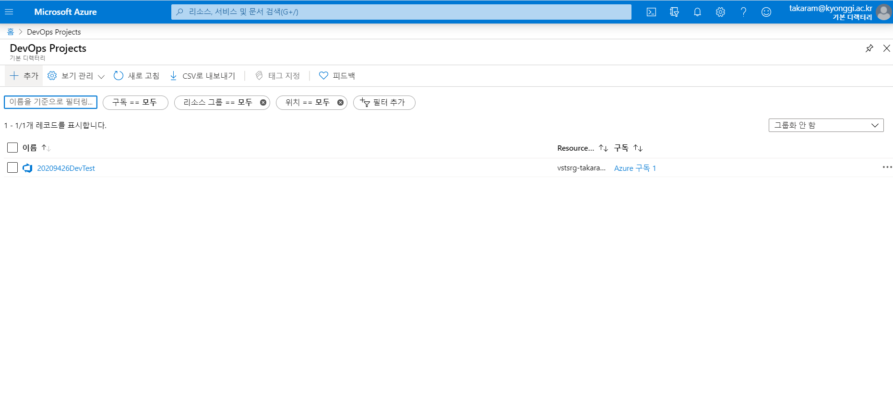

3. 그리고 Java를 선택해서 Spring으로 진행

4. 

   

5. 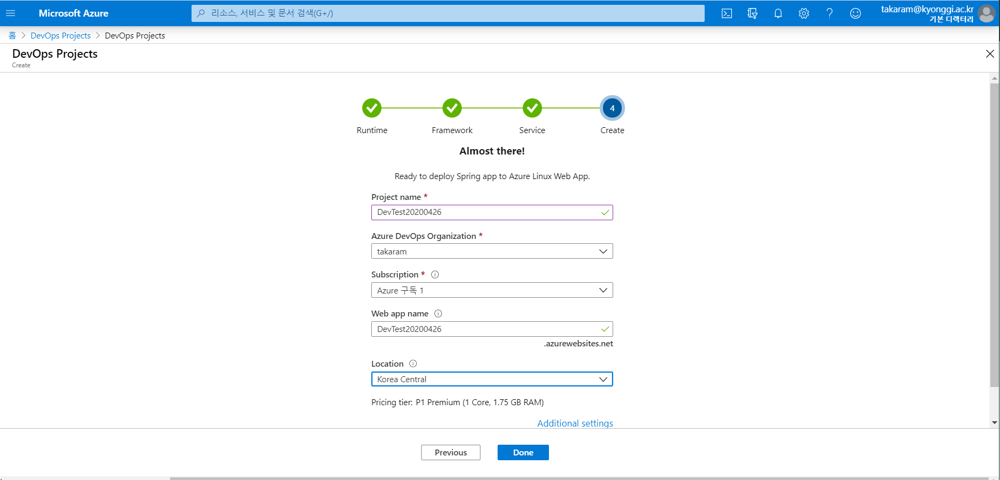

6. 

   프로젝트 홈페이지로 간다

7. 

8. 새로운 파이프 라인 생성으로 가서

9. 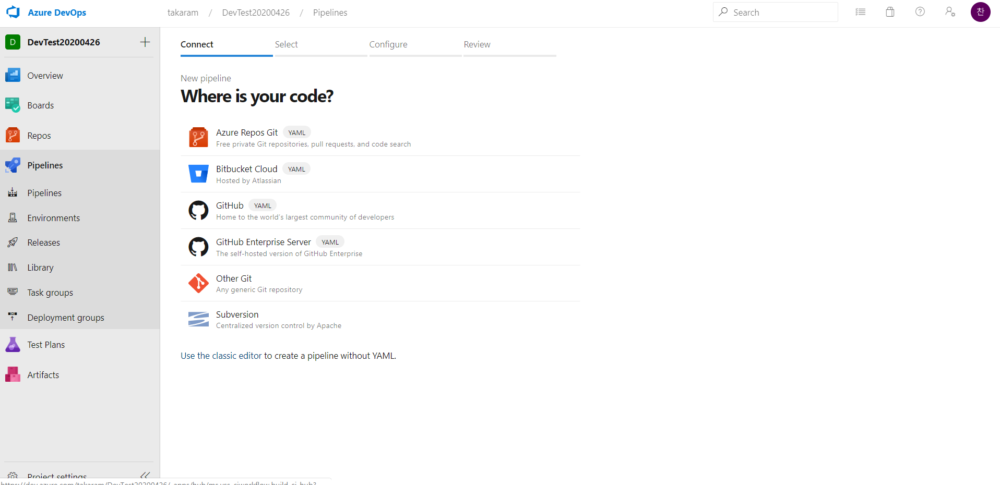

10. Use the classic Editor 클릭

11. 

12. 이것들 중에 좋을 대로 선택. 난 깃으로 하기 위해 깃을 선택했다

13. 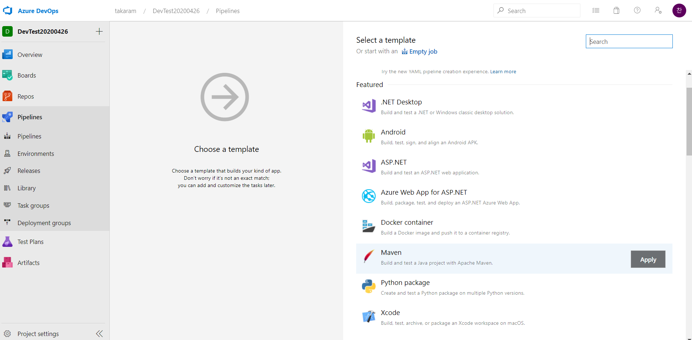

14. 그리고 스프링이기 때문에 Maven 클릭

15. 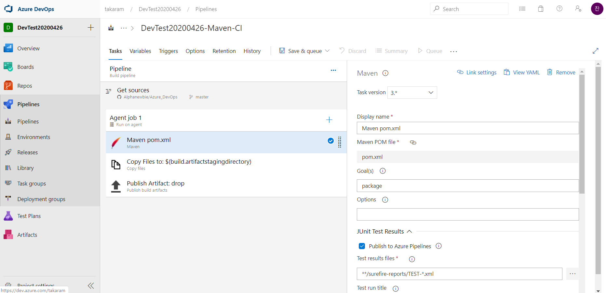

16. 설정은 마음대로 정한다.

    1. Maven Pom은 아마 건드릴것이 Code coverage Tool만 난 이것도 안 건드림

    2. Copy File은 무슨 형식으로 생성할 것인지, Jar이나 War로 나중에 이걸로 빌드한다.

    3. 마지막은 어디에 생성할것인지 정한다. 즉, drop폴터에 생성된다는 뜻

    4. 그리고 Save&Queue로 저장

    5. 가끔 이런 에러가 뜬다

    6. 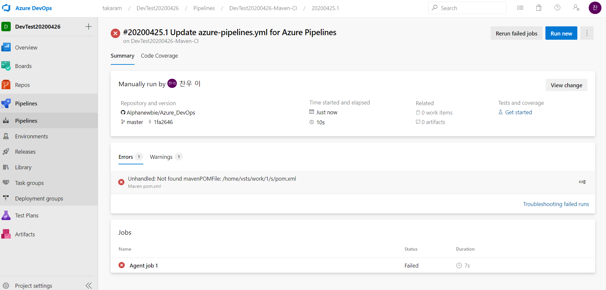

       Maven File을 못 찾았다는 뜻이다. 나의 경우엔 Git에 있으니 깃을 찾아보자

       

       보면 Application 하위의 pom.xml에 있다.

       Edit pipline으로 가서

       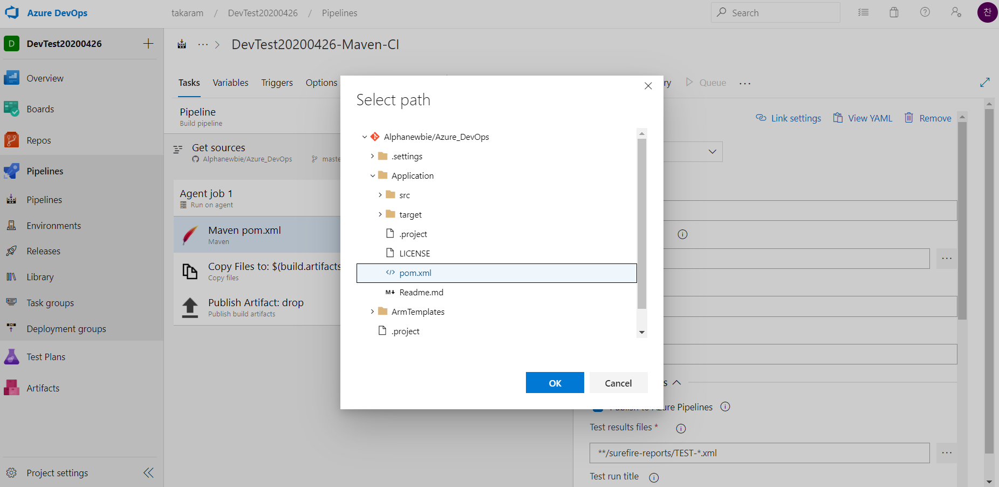

       Pox.xml의 경로를 바꿔준다.

17. 그럼 이제 배포할 차례, release PipeLine으로 가서 새로운 파이프 라인을 만든다

18. 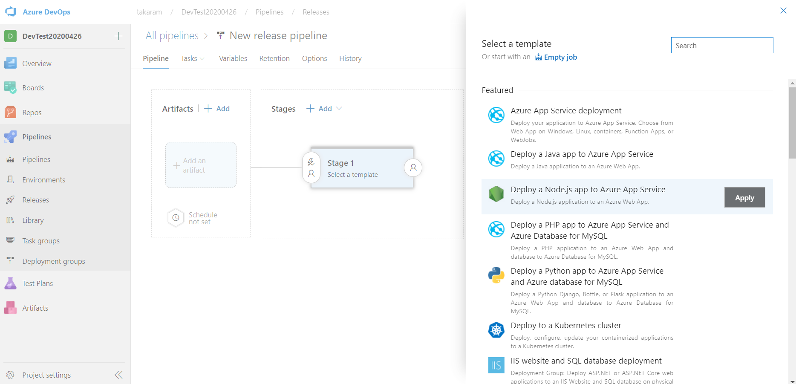

19. 이중에서 Deploy a Java app to Azure App Service을 선택한다.

20. 

21. 그리고 Azure로 가서 DevOps테스트할 WebApp을 만들어준다.

22. 

23. 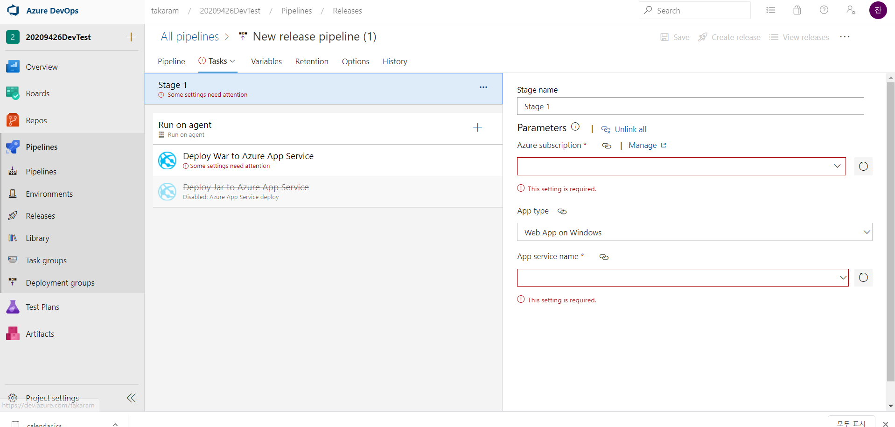

24. 순서대로 Web앱을 가지고 있는 서브 스크립션을 넣어주고

25. 아래의 빨간 줄에는 WebApp의 이름을 기입한다.

26. 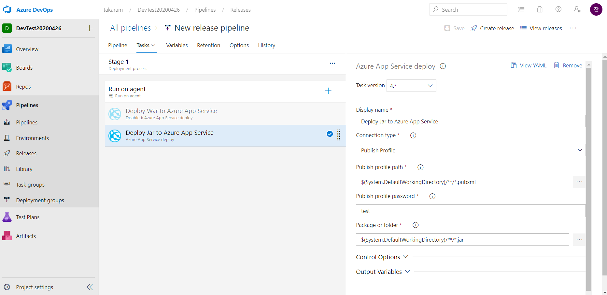

27. 그리고 Jar의 파일을 선택한다.

    1. 난 위의 Jar의 파일이 너무 많이 생겨서 War나중에 war로 파일로 생성하는 걸로 했는데...
    2. 동기화가 안되는 문제가 생겼다.
    3. 온갖 방법을 다 시도해 봐도 war이 최신 버전으로 갱신되지 않는 문제였다...

28. 자동 배포를 켜주면, 업로드 될때마다 배포 완료

29. 

## 깃과의 연동

7번까지의 과정은 같다.

8. 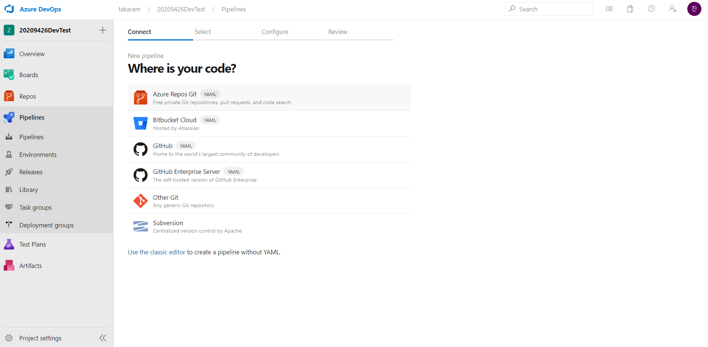

9. 저 중에서 Git을 선택한다.

10. 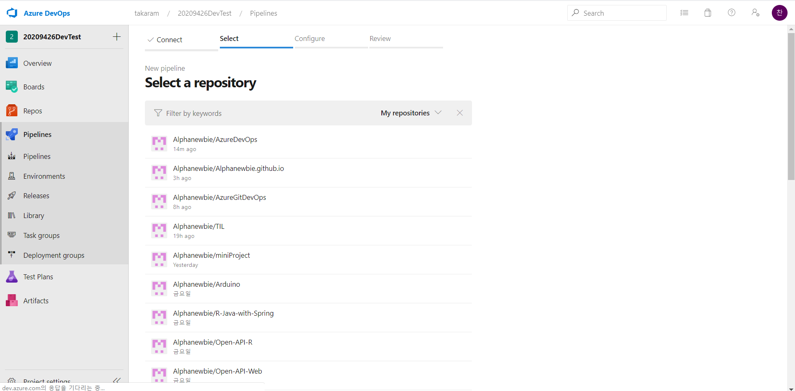

11. 원하는 레포지토리 선택

12. 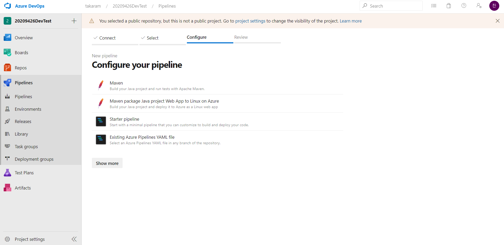

13. 우리는 웹 앱이 목표 이므로 메이븐 두번째꺼 선택한다.

14. 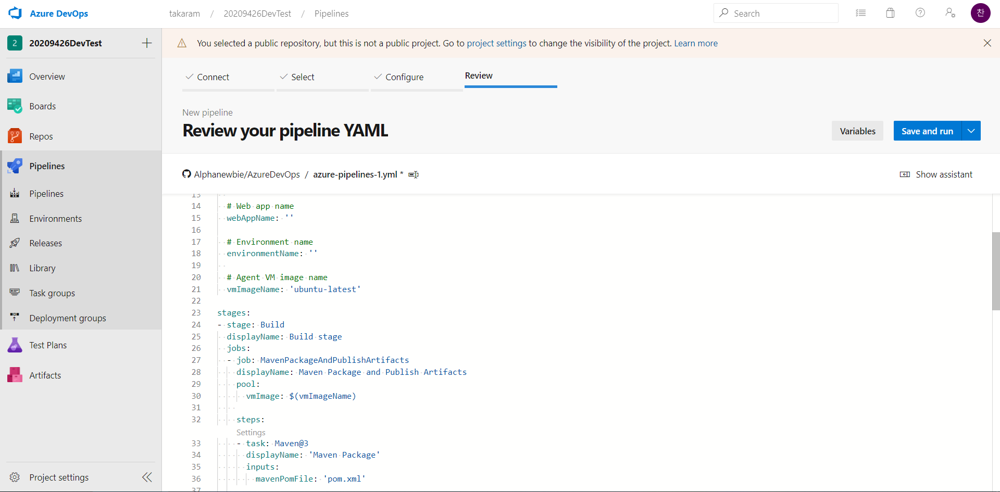

15. 마지막으로 

    1. mavenPomFile: 'pom.xml'의 경로를 프로젝트 내부에 있는 pom.xml의 위치로 변경시킨다.

    2.  webAppName:  ''    의 ''안의 빈칸에 Webapp의 이름으로 변경 시킨다.

       1. 예) webAppName: '20200426GitDevTest'

    3.  environmentName: '20200426GitDevTest' 와

    4. displayName: 'Azure Web App Deploy: 20200426GitDevTest' 

    5. 이 2개도 똑같이 WebApp의 이름으로 변경시킨다.

    6. 마지막으로 package: '$(Pipeline.Workspace)/drop/\*\*/target/*.(war|jar)'이렇게 되어 있는 것

       package: '$(Pipeline.Workspace)/drop/\*\*/target/*.war'

       로 변경 시킨다.

       -> 이유 : jar은 너무 많은 파일이 생성 되서 구분하기 쉽게 war로 변경 시킨다.

16. 생성후 이제 릴리즈 진행

17. 

18. Git 말고 빌드되 있는 파이브 라인을 지정한다.

19. 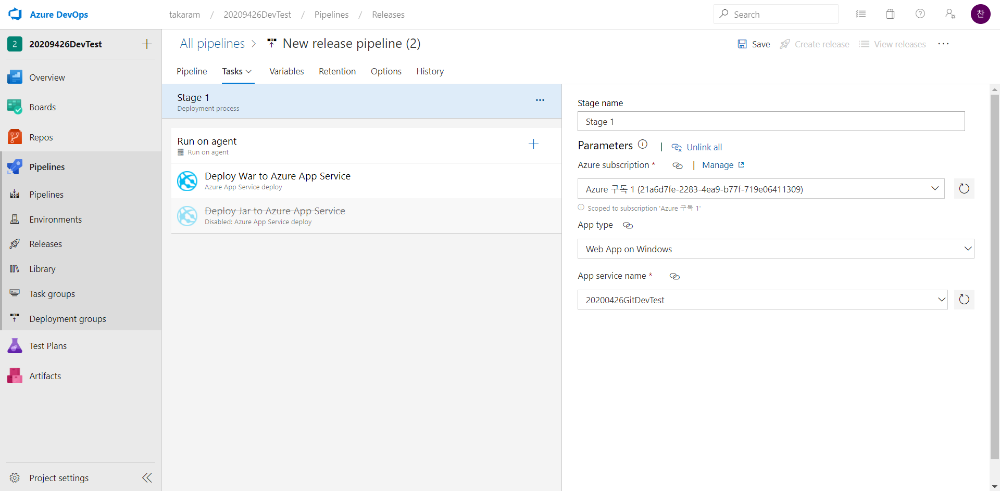

20. 지정 후

21. 

22. war파일로 생성했으므로 war로 지정하고 Package or folder로 가서 패키지 이름 지정하고 빌드 하면 끝!

23. 추가로 위에 Releae파이프 라인 자동 배포 똑같이 선택한 다음에 이번엔 Build를 자동으로 하는 방법

24. Pipeline 항목으로 들어가서 

25. Edit 눌러서 // 참고로 아까 webapp지정을 하지 않았다면 이곳에서 수정도 가능하다.

26. 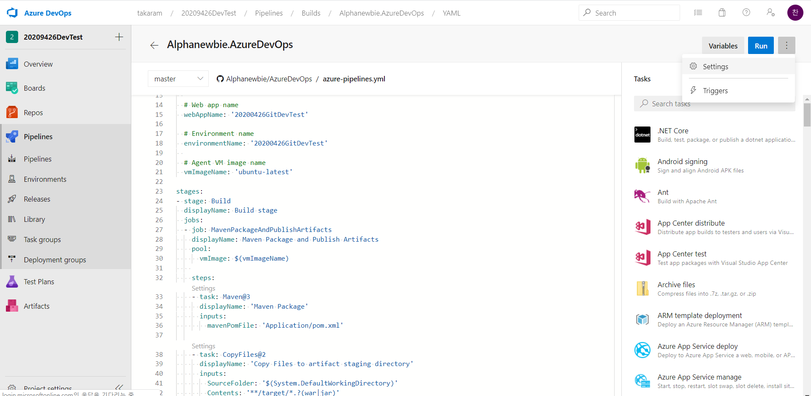

27. Tiger선택

28. 

29. Override the YAML pull request trigger from here

30. 옵션을 지정하면 Git에 새로운 Commit 이 올라오는 순간 자동으로 빌드가 가능하다.