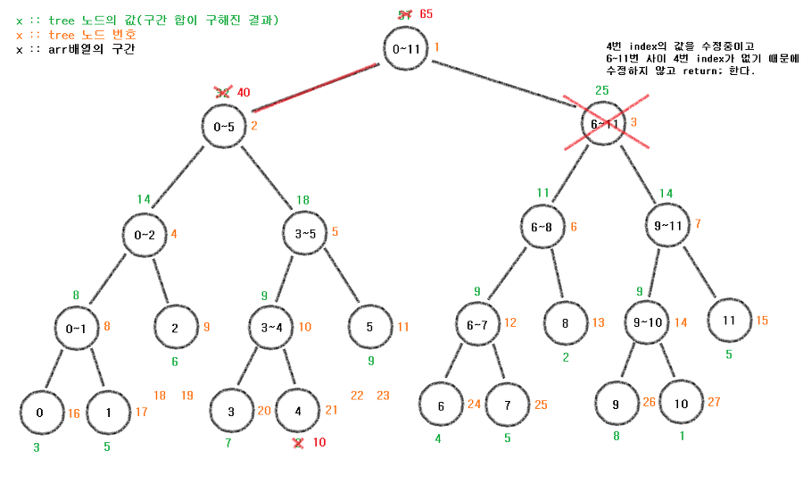
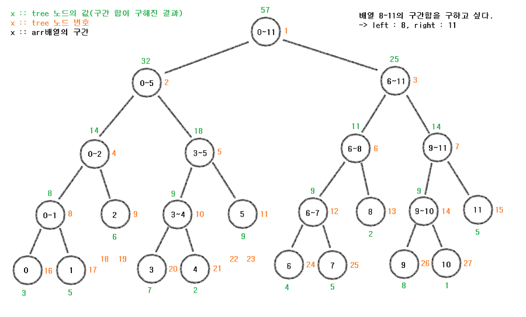
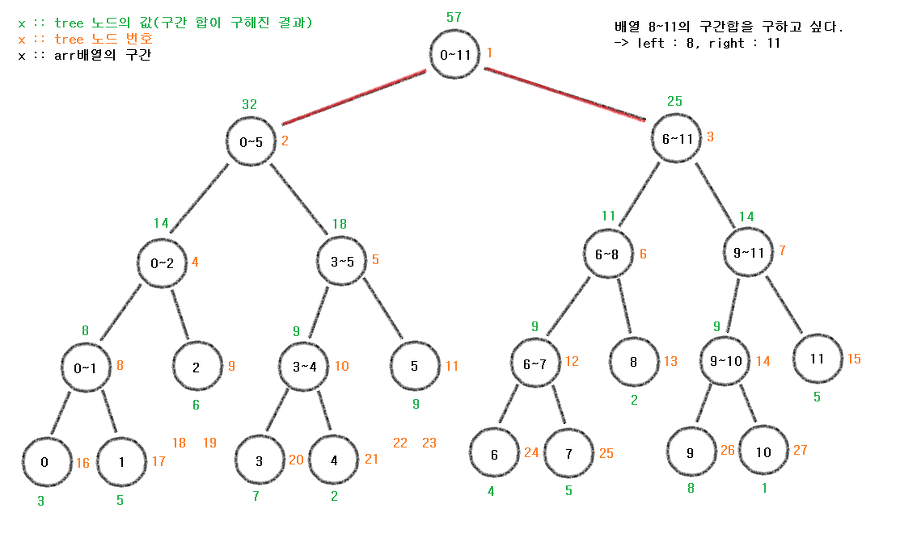
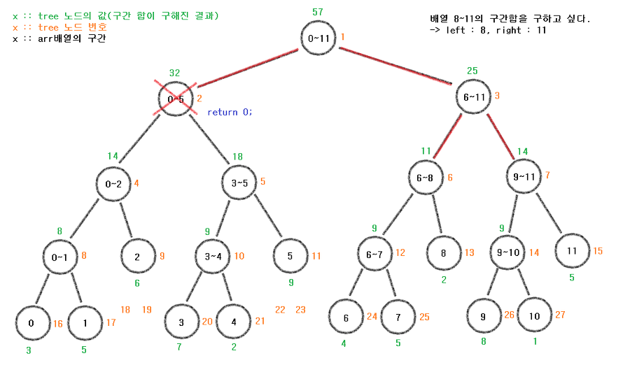
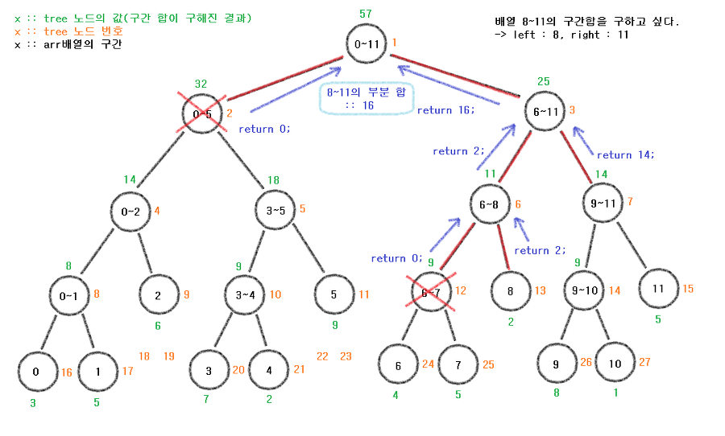

# 세그먼트 트리

주어진 쿼리에 대해 빠르게 응답하기 위해 만들어진 자료 구조.

예를 들면 1 2 3 4 5 6 이라는 배열 arr이 있었다면,

arr[2] + arr[3] + arr[4] 를 구하라는 쿼리를 요청 받고 arr[3]를 10으로 바꾸고 arr[2] + arr[3] + arr[4]를 다시 구하라는 쿼리가 오면

한번 실행하는데 걸리는 시간은

수를 바꾸는데 O(1), 수를 더하는데 O(N)이니 M번 수행한다 치면 **O(MN+M) -> O(MN)**의 시간이 걸린다.


### 세그먼트 트리의 장점

위의 식과 비교하면 세그먼트 트리는

**수를 바꾸는 과정 :: O(logN)**

**수를 더하는 과정 :: O(logN)**

M번 실행한다 치면 **O(MlongN + MlogN)-> O(MlogN)**이 걸리게 된다.


***세그먼트 트리는 대부분 완전 이진 트리이다.***


***

### 그림을 통한 세그먼트 트리 확인


위의 그림은 N=12일때의 모습이다.

제일 아래 **리프 노드**로 달린 것들이 **실제 우리가 처음에 받아온 데이터**들이다.

- 여기서는 0,1,2,3,4,5,6,7,8,9,10,11라고 적힌 노드들을 의미한다.

**x~y의 의미**는

**x부터 y까지의 합의 범위**를 나타낸것


즉, 최상위 루트는 입력된 모든 값의 총 합을 의미한다.


### 세그먼트 트리의 전체 크기 구하기


N = 12일 때의 **세그먼트 트리의 전체 크기(배열 사이즈 정하기)**를 구하기 위해서는 

**2^k로 12보다 바로 큰 값을 만들 수 있는 k**를 찾아야한다. 즉, k는 4이다.


그리고 난 뒤 **2^k를 하면 16이 되고 16에 \*2**를 하면 우리가 원하는 세그먼트 트리의 크기를 구할 수 있다. 


이 과정이 귀찮다면 그냥 **N \* 4**를하면(여기서는 48이 세그먼트 트리 크기가 될 것이다.)

메모리는 조금 더 먹지만, 편리하게 이용할 수 있다.


C++의 경우, h를 구하는 방법

```c++
int h = (int)ceil(log2(n));
int tree_size = (1 << (h+1));  
```

이렇게 나타낼 수 있는데 ceil은 올림을 하겠다는 의미이고, log2N에서 도출되는 값을 올림한 값을 h에 저장한다.

즉 log2(12) = 3.xxx이고 올림한 4를 h에 저장한다.


1 << (4+1) = 1 << 5 = 32가 결국 tree_size가 된다.


Java의 경우, h를 구하는 방법

```java
int h = (int)Math.ceil(Math.log(n)/Math.log(2));
int[] tree = new int[(int) Math.pow(2, h+1)];
```


### segment tree node에 값들이 쌓이는 원리


세그먼트 트리를 형성할 때 **루트 노드**를 **1**로 생각한다.

이때 **루트노드 왼쪽 노드는** **2**번 노드가 될 것이고 **오른쪽 노드는 3**번 노드가 될 것이다.

그리고 **2번노드의 왼쪽 노드**는 **4**번, **오른쪽 노드는 5**번이 될 것이다.

또한 **3번 노드의 왼쪽 노드는 6**번, **오른쪽 노드는 7**번이 될 것이다.


***포인터로 동적할당을 통한 트리가 아닌 배열로 트리를 만들고 있다***.

그 이유는 **세그먼트 트리**는 ***full binary tree***에 가깝기에 ***배열에 모든 값들이 꽉꽉차서 올 가능성이 매우 높기***때문에 

포인터보다는 배열을 이용하게 된다. 그리고 ***각 노드마다의 왼쪽, 오른쪽 자식 노드는 항상 규칙이 정해져 있다***.


### 세그먼트 트리를 만드는 방법

**tree 배열은 세그먼트 트리가 만들어지는 배열이고**

**arr 배열은 처음에 입력받아 생성된 배열이다.**


#### 1. 초기화 과정(init)

초기화라는 의미는 결국 위의 그림과 같은 트리를 생성하는 것이다.(가장 초기상태의 트리)

이 초기화 과정을 거고 나면 결국 구간 합 트리가 형성된다.


만약 arr[12] = {3, 5, 6, 7, 2, 9, 4, 5, 2, 8, 1, 5}였다면 다음과 같은 구간 합 세그먼트 트리가 나올 것이다.


```c++
ll init(vector<ll> &arr, vector<ll> &tree, int node, int start, int end)
{
    if (start == end)
        return tree[node] = arr[start];
 
    int mid = (start + end) / 2;
 
    return tree[node] = init(arr, tree, node * 2, start, mid) + init(arr, tree, node * 2 + 1, mid + 1, end); 
}


// 출처: https://www.crocus.co.kr/648 [Crocus]
```

위의 그림을 통해 init의 함수에 대해 알아보자.


(ll은 long long 타입입니다.)

```c++
ll init(vector<ll> &arr, vector<ll> &tree, int node, int start, int end)
```

우선 인자로는 **arr벡터(배열), tree벡터(배열), 노드번호, 노드의 시작번호, 노드의 끝번호**이다.


```c++
if (start == end)
	return tree[node] = arr[start];
```

start == end일 때 tree[node] = arr[start]를 받는다.


-> start == end라는 의미는 아래 코드를 확인해야 해석이 가능하다.

```c++
return tree[node] = init(arr, tree, node * 2, start, mid) + init(arr, tree, node * 2 + 1, mid + 1, end); 
```

start != end일때는 위의 return tree[node] = init(~) + init(~)로 들어가게 된다.

init인자로 자세히 보면 node*2와 node*2+1이 있다.


위에서 언급했다시피 **각 노드의 왼쪽 자식과 오른쪽 자식으로 분리되는 과정**을 보여주는 것이다.


그리고 **왼쪽 자식쪽에는 start ~ mid**를 보내고, **오른쪽 자식에는 mid+1 ~ end**를 보낸다.

(mid :: (start + end) / 2)

이 의미는 arr의 값을 반틈씩 쪼개어 계속 보내고 있는 것을 의미한다.


즉, 반복하다보면 1번 노드는 루트 노드로써 모든 값이 다 더해진 부분

자식 노드는 h/2 = 즉 tree[16]번째부터 차례로 자식노드가 들어가는 것을 알 수 있다.

하지만, 만약 위의 5번 노드 처럼 자식 노드가 없는 경우에는 5번의 자식 노드인 tree[18], tree[19]는 아무 값이 들어가지 않는다. 즉 0이나 null값이 들어가 있게 된다.

***

arr[12] = {3, 5, 6, 7, 2, 9, 4, 5, 2, 8, 1, 5}라고 했을 때

첫 init(arr, tree, node * 2, start, mid)에 의해 들어가는 인자를 숫자로 표현해보면


init(arr, tree, 2, 0, 5)이 들어간다.

즉, 1번 루트 노드의 왼쪽 자식(2번 노드)에는 arr[0~5] ( = arr[start~mid) )값이 들어간다는 것이다.


그다음 init(arr, tree, node * 2 + 1, mid+1, end)는

init(arr, tree, 3, 6, 11) 다음과 같이 들어간다.

즉, 1번 루트 노드의 오른쪽 자식(3번 노드)에는 arr[6~11]] ( = arr[mid+1~end) )값이 들어간다는 것이다.

***

이제 다시 start == end의 의미를 파악해보자.

```c++
if (start == end)
	return tree[node] = arr[start];
```

노드가 계속 분할되어 결국 start와 end가 같아지는 부분이 생길 것이다.

이때 의미는 arr[start~end]가 결국 arr[start]와 같다는 의미이고, 결국 노드의 범위가 1인 리프 노드를 의미한다.


따라서 가장 아래까지 내려왔다면 현재 node번째인 tree[node]에 arr[start]값을 대입해준다는 의미이다.


그림으로 확인해 본다면 다음과 같은 과정이 이루어 지는 것이다.


이렇게 init함수를 재귀를 통해 반복하면 위의 그림이 완성된다.


tree배열을 출력해 보면 이런 값이 나온다

0 57 32 25 14 18 11 14  8  6  9  9  9  2  9  5  3  5  0  0  7  2  0  0  4  5  0  0  8  1  0  0


자바의 코드

```java
static int init(int[] arr,int[] tree,int node, int start, int end)
{
	if (start == end)
		return tree[node] = arr[start];
	int mid = (start + end) / 2;
	return tree[node] = 
        init(arr,tree, node * 2, start, mid) + 
        init( arr,tree, node * 2 + 1, mid + 1, end); 
}
```


#### 2. 갱신(update)


```c++
void update(vector<ll> &tree, int node, int start, int end, int index, ll diff)
{
    if (!(start <= index && index <= end))
        return;
    
    tree[node] += diff;
 
    if(start != end)
    {
        int mid = (start + end) / 2;
        update(tree, node * 2, start, mid, index, diff);
        update(tree, node * 2 + 1, mid + 1, end, index, diff);
    }
 
}

//출처: https://www.crocus.co.kr/648 [Crocus]
```


일단,  호출

```c++
void update(vector<ll> &tree, int node, int start, int end, int index, ll diff)
```

tree 벡터(배열), node번호, start, end 그리고 바꾸고자하는 인덱스 번호(바꾸고자 하는 노드 번호), 차이를 인자로 한다.


```c++
if (!(start <= index && index <= end))
	return;
```


start와 end사이에 index가 있지 않다면? retrun 해버린다.




현재 세그먼트 트리를 기준으로 21번 노드의 값을 2에서 10으로 변경하려한다.


void update(vector<ll> &tree, int node, int start, int end, int index, ll diff)


우리는 **node**를 1번 노드부터 시작할 것이고, **start**는 0번, **end**는 11번, **index**는 4번, **diff**는 10 - 2를뺀 8이다.

```c++
if (!(start <= index && index <= end))
	return;
```

현재 index :: 4는 0 <= 4 <= 11이다.

따라서 if문에는 걸리지 않고 넘어간다.

```c++
tree[node] += diff;

if(start != end)
{
	int mid = (start + end) / 2;
	update(tree, node * 2, start, mid, index, diff);
	update(tree, node * 2 + 1, mid + 1, end, index, diff);
}
```


tree[node] += diff;

tree[1] += 8;

이 말은 무엇이냐면, 아까 2에서 10으로 값이 변했을 때 변화값이 8이니

전체 구간 합(tree[1])도 8만큼 값을 증가시켜야 한다는 말이다.


이제 start != end이니 각 update로 다시 들어가보자.


update(tree, 2, 0, 5, 4, 8);

update(tree, 3, 6, 11, 4, 8);으로 받아지게 될 것이다.


위의 update를 타고 들어가면 start = 0, end = 5가 되어있어서

```c++
if (!(start <= index && index <= end))
	return;
```

0 <= 4 <= 5라 걸리지 않고 tree[node] += diff를 하게 되지만,

아래 update는 타고 들어가면 start = 6, end = 11이어서

6<= 4 <= 11에 걸리게 된다.


이런 과정을 통해 이런 모습이 된다.


tree출력 결과는

0 65 40 25 14 26 11 14  8  6 17  9  9  2  9  5  3  5  0  0  7 10  0  0  4  5  0  0  8  1  0  0

이렇게 수정되는 것을 알 수 있다.

자바의 코드는 이렇게 된다.

```java
static void update(int[] tree, int node, int start, int end, int index, int diff)
{
    if (!(start <= index && index <= end))
        return;
    
    tree[node] += diff;
 
    if(start != end)
    {
        int mid = (start + end) / 2;
        update(tree, node * 2, start, mid, index, diff);
        update(tree, node * 2 + 1, mid + 1, end, index, diff);
    }
}
```


#### 3. 합 과정

**합을 구하는 과정은 4가지 경우로 나눌 수 있다.**

**1. [left, right]와 [start, end]가 겹치지 않는 경우**

-> 즉 아에 구간 합을 구하고자 하는 범위와 상관이 없는 경우

:: **if(left > end || right < start)**로 표현 할 수 있다.

**2. [left, right]가 [start, end]를 완전히 포함하는 경우**

-> 즉, 구하고자 하는 구간 합 구간에 포함되는 경우

:: **if(left <= start && end <= right)로 표현할 수 있다.**

**3. [start, end]가 [left, right]를 완전히 포함하는 경우** 

-> 즉, 구하고자 하는 구간 합 범위보다는 크게 있지만 그 내부에 구하고자 하는 구간 합 범위가 있는 경우

**:: return sum(tree, node\*2, start, mid, left, right) + sum(tree, node\*2+1, mid+1, end, left, right)로 표현할 수 있다.**

**4. [left, right]와 [start, end]가 겹쳐져 있는 경우(1,2,3을 제외한 나머지 경우)**

-> 즉, left <= start <= right <= end같은 방식인 경우

**:: return sum(tree, node\*2, start, mid, left, right) + sum(tree, node\*2+1, mid+1, end, left, right)로 표현할 수 있다.**

결론적으로 3,4는 재탐색을 해야하고 1,2,3,4를 합치면 아래 코드처럼 표현할 수 있다.

```c++
ll sum(vector<ll> &tree, int node, int start, int end, int left, int right)
{
    if (left > end || right < start)
        return 0;
 
    if (left <= start && end <= right)
        return tree[node];
 
    int mid = (start + end) / 2;
    return sum(tree, node * 2, start, mid, left, right) + 
        sum(tree, node*2+1, mid+1, end, left, right);
}


// 출처: https://www.crocus.co.kr/648 [Crocus]
```


인자를 보면 다음과 같다.

tree, node번호, start번호, end번호, left, right

여기서 left와 right는 구간 left~right의 합을 구해달라는 의미이다.

합 과정 또한 그림으로 확인해보자.

다음과 같이 8~11의 구간합을 구하고 싶다고 가정한다.

이때 left는 8, right는 11이 될 것이다.



일단 루트 노드부터 관찰해보자

```c++
if (left > end || right < start)
    return 0;
```

if(8 > 11 || 11 < 0)이니 둘다 만족하지 않는다. 따라서 다음 단계로 간다.


```c++
if (left <= start && end <= right)
	return tree[node];
```

if(8 <= 0 && 11 <= 11)이니 다음 단계로 간다.


```c++
int mid = (start + end) / 2;

return sum(tree, node * 2, start, mid, left, right) + 
    sum(tree, node*2+1, mid+1, end, left, right);

```



이제 2번 노드(arr 0~5번 배열의 구간합을 가진 노드)와 3번 노드(arr 6~11번 배열의 구간합을 가진 노드)를 관찰해야 한다.


2번 노드부터 보자.

```c++
if (left > end || right < start)
	return 0;
```

left(8)는 end(5)보다 크다. 그리고 right(11)은 start(0)보다 크다.


따라서 left > end가 만족하므로 return 0;을 해버린다.


다음은 3번 노드(arr 6~11번 배열의 구간합을 가진 노드)를 관찰해야 한다.

```c++
if (left > end || right < start)
	return 0;
```

해당사항이 없으니 넘어간다.


```c++
if (left <= start && end <= right)
	return tree[node];
```


left :: 8 start :: 6 right :: 11 end :: 11이다.


if(0 && 1)이니 넘어간다.

```c++
int mid = (start + end) / 2;
return sum(tree, node * 2, start, mid, left, right) + 
    sum(tree, node*2+1, mid+1, end, left, right);
```

위의 코드에 의해 다음과 같이 그림이 생성된다.




모든 과정의 결과는 이런 모습이 된다.





자바 코드

```java
static int sum(int[] tree, int node, int start, int end, int left, int right)
{
    if (left > end || right < start)
		return 0;
	 
	if (left <= start && end <= right)
		return tree[node];
	 
	int mid = (start + end) / 2;
	return sum(tree, node * 2, start, mid, left, right) + 
        sum(tree, node*2+1, mid+1, end, left, right);
	}
```


### 최종 코드

```java
public class Main {

	public static void main(String[] args) 
    {
		int[] arr = new int[] { 3, 5, 6, 7, 2, 9, 4, 5, 2, 8, 1, 5 };
		int n = 12;
		int h = (int) Math.ceil(Math.log(n) / Math.log(2));

		int[] tree = new int[(int) Math.pow(2, h + 1)];

		init(arr, tree, 1, 0, 11);

		for (int i = 0; i < tree.length; i++) {
			System.out.printf("%3d", i);
		}
		System.out.println();
		for (int i = 0; i < tree.length; i++) {
			System.out.printf("%3d", tree[i]);
		}

		update(tree, 1, 0, 11, 4, 8);
		System.out.println();
		for (int i = 0; i < tree.length; i++) {
			System.out.printf("%3d", tree[i]);
		}
		System.out.println();
		System.out.println(sum(tree, 1, 0, 11, 8, 11));

	}

	static int init(int[] arr, int[] tree, int node, int start, int end) 
    {
		if (start == end)
			return tree[node] = arr[start];

		int mid = (start + end) / 2;

		return tree[node] = init(arr, tree, node * 2, start, mid) + 
				init(arr, tree, node * 2 + 1, mid + 1, end);
	}

	static void update(int[] tree, int node, int start, int end, int index, int diff)
    {
		if (!(start <= index && index <= end))
			return;

		tree[node] += diff;

		if (start != end) {
			int mid = (start + end) / 2;
			update(tree, node * 2, start, mid, index, diff);
			update(tree, node * 2 + 1, mid + 1, end, index, diff);
		}

	}

	static int sum(int[] tree, int node, int start, int end, int left, int right) 
    {
		if (left > end || right < start)
			return 0;

		if (left <= start && end <= right)
			return tree[node];

		int mid = (start + end) / 2;
		return sum(tree, node * 2, start, mid, left, right) + 
				sum(tree, node * 2 + 1, mid + 1, end, left, right);
	}

}

```


출처: https://www.crocus.co.kr/648 [Crocus]

