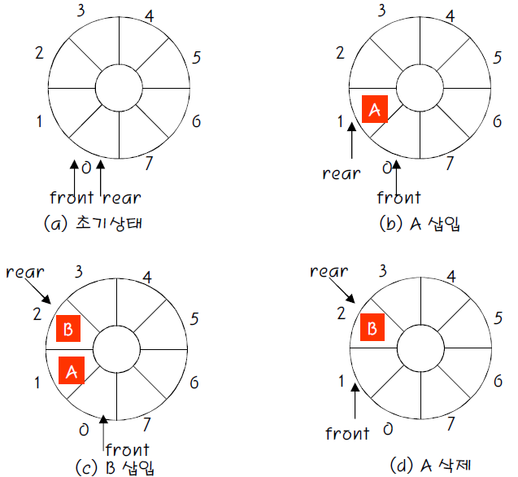
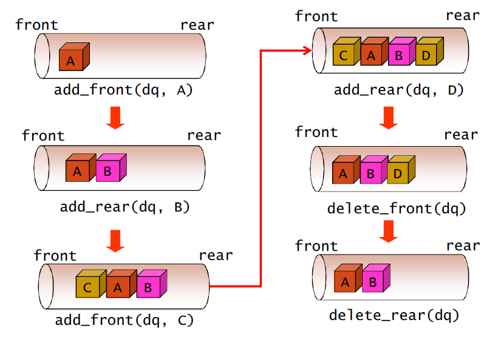

# 자료구조

## 큐(Queue)

먼저 들어온 데이터가 먼저 나가는 자료 구조

​	-> 선입선출(FIFO)

삽입은 큐의 후단(rear)에서, 삭제는 전단(front)에서 이루어진다.


### 큐의 응용

- 컴퓨터와 프린터 사이의 버퍼링

- 컴퓨터 네트워크에서 데이터 패킷들의 store-and-forward
- 시뮬레이션의 대기열


### 선형큐
- 배열을 선형으로 사용하여 큐를 구현
- 삽입을 계속하기 위해서는 요소들을 이동시켜야 함
- 문제점이 많아 사용되지 않음


### 원형큐

- 배열을 원형으로 사용하여 큐를 구현

#### 원형 큐의 구조

- 큐의 전단과 후단을 관리하기 위한 2개의 변수 필요
  - front: 첫번째 요소 하나 앞의 인덱스
  - rear: 마지막 요소의 인덱스



#### 공백상태, 포화상태

- 공백상태: front == rear
- 포화상태: front==(rear+1) % M
- 공백상태와 포화상태를 구별하기 위하여 하나의 공간은 항상 비워둔다


### 큐 ADT

```c++
template<typename T> class Queue
{
private:
	T* queue;
	int maxsize;
	int front;
	int rear;

public:
	Queue() 
	{
		maxsize = QUEUESIZE;
		queue = new T[maxsize];
		front = 0;
		rear = 0;
	}

	~Queue()
	{
		maxsize = NULL;
		delete(queue);
		front = NULL;
		rear = NULL;
	}

	void push(T item)
	{
		if (isFull())
		{
			return;
		}
		else
		{
			rear = (rear + 1) % maxsize;
			queue[rear] = item;
		}
	}

	T pop()
	{
		if (isEmpty()) 
		{
			return NULL;
		}
		else
		{
			front = (front + 1) % maxsize;
			return queue[front];
		}
	}

	bool isFull()
	{
		if ((rear + 1) % maxsize == front)
			return true;
		else
			return false;
	}

	bool isEmpty()
	{
		if (front == rear)
			return true;
		else
			return false;
	}

	int isSize()
	{
		int tmp = rear - front;
		return tmp >= 0 ? tmp : maxsize + tmp;
	}
};
```


## 연결된 큐(Linked Queue)

- Linked List로 구현된 큐
- front 포인터는 삭제와 관련되며 rear 포인터는 삽입
- front는 연결 리스트의 맨 앞에 있는 요소를 가리키며, rear 포인터는 맨 뒤에 있는 요소를 가리킨다
- 큐에 요소가 없는 경우에는 front와 rear는 NULL
- 장점: 크기가 제한되지 않음
- 단점: 코드가 약간 더 복잡해짐, 링크필드 때문에 메모리 공간 더 많이 사용


```c
typedef int element;

typedef struct QueueNode {
	element item;
	struct QueueNode *link;
} QueueNode;

typedef struct {
	QueueNode *front, *rear;
} QueueType;

void init(QueueType *q)
{
	q->front == q->rear = NULL;
}
// 공백 상태 검출 함수
int is_empty(QueueType *q)
{
	return (q->front == NULL);
}
// 포화 상태 검출 함수
int is_full(QueueType *q)
{
	return 0;
}
// 삽입 함수
void enqueue(QueueType *q, element item) {
	QueueNode *temp = (QueueNode *)malloc(sizeof(QueueNode));
    
	if(temp == NULL)
		error(“메모리를 할당할 수 없습니다");
	else {
			temp->item = item;
			temp->link = NULL;
		if (is_empty(q)) {
			q->front = temp;
			q->rear = temp;
		}
		else {
			q->rear->link = temp;
			q->rear = temp;
		}
	}
}
// 삭제 함수
element dequeue(QueueType *q) {
	QueueNode *temp = front;
	element item;
	if( is_empty(q) )
		error("큐가 공백상태입니다");
	else {
		item = temp->item;
		q->front = q->front->link;
		if (q->front == NULL)
			q->rear = NULL;
		free(temp);
		return item;
}
```

## 덱(Deque)

- Double-Ended Queue의 줄임말
- 큐의 전단(front)와 후단(rear)에서 모두 삽입과 삭제가 가능한 큐


### 덱의 연산



### 이중 연결 리스트를 이용한 덱의 구현

- 양쪽에서 삽입, 삭제가 가능하여야 하므로 일반적으로 이중 연결 리스트(Doubly Linked List) 사용

#### 덱의 삽입 연산


#### 덱의 삭제 연산


### Deque code
```Python
class Node:
    def __init__(self, item):
        self.item = item
        self.l_node = None
        self.r_node = None

class Deque:
    def __init__(self):
        self.cnt = 0
        self.head = None
        self.tail = None

    def size(self):
        return self.cnt

    def empty(self):
        return True if self.cnt == 0 else False

    def front(self):
        if self.empty():
            return -1
        return self.head.item

    def back(self):
        if self.empty():
            return -1
        return self.tail.item

    def push_front(self, item):
        new_node = Node(item)
        if self.head:
            new_node.r_node = self.head
            self.head.l_node = new_node
        else:
            self.tail = new_node
        self.head = new_node
        self.cnt += 1

    def push_back(self, item):
        new_node = Node(item)
        if self.head:
            new_node.l_node = self.tail
            self.tail.r_node = new_node
        else:
            self.head = new_node
        self.tail = new_node
        self.cnt += 1

    def pop_front(self):
        if self.empty():
            return -1
        output = self.front()
        temp = self.head
        self.head = self.head.r_node
        if self.head:
            self.head.l_node = None
        else:
            self.tail = None
        del temp
        self.cnt -= 1
        return output

    def pop_back(self):
        if self.empty():
            return -1
        output = self.back()
        temp = self.tail
        self.tail = self.tail.l_node
        if self.tail:
            self.tail.r_node = None
        else:
            self.head = None
        del temp
        self.cnt -= 1
        return output

    def printall(self):
        node = self.head
        while node:
            print(node.item)
            node = node.r_node

```