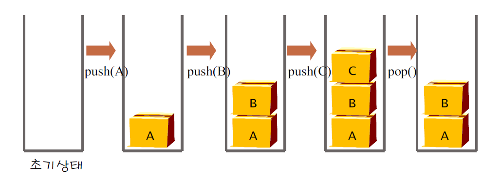
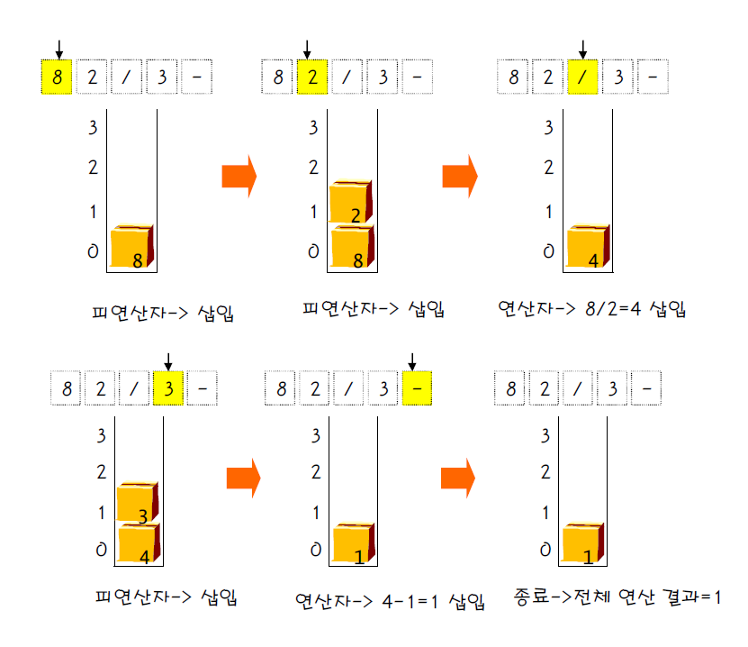
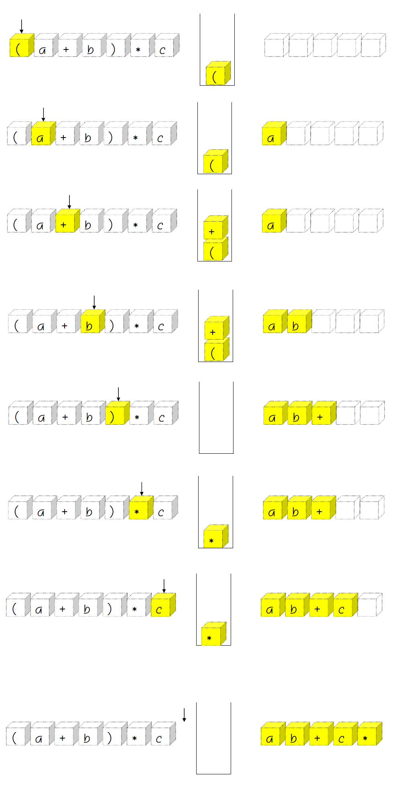

# 자료구조

https://github.com/Alphanewbie/TIL/tree/master/Bae-joon/10828

## 스택(Stack)

- 스택(stack): 데이터를 쌓아놓은 더미
- 후입선출(LIFO:Last-In First-Out)
  - 가장 최근에 들어온 데이터가 가장 먼저 나감


### 스택의 용도

- 입력과 역순의 출력이 필요한 경우
  - 에디터에서 되돌리기(undo) 기능
  - 함수호출에서 복귀주소 기억
  - 괄호검사
  - 중위표기수식 → 후위표기수식 -  컴퓨터의 계산 방식은 후위 표기 수식이다.


### 스택의 연산

- push(s) : 스택에 데이터 삽입
  - 스택의 최상단에 값을 넣는다.
- pop(s) : 스택에 데이터 삭제
  - 스택의 최 상단의 값을 꺼내오고, 그리고 그 값을 삭제한다.
- is_empty() : 스택이 공백상태인지 검사
  - 스택이 비어 있는지 확인한다.
- is_full() :스택이 포화상태인지 검사
  - 스택이 꽉 차 있는지 확인한다
- init() :스택을 생성
  - 스택을 초기화 하는 부분
- peek(s): 요소를 스택에서 삭제하지 않고 보기만 하는 연산


### 스택의 구조 시각화




### 후위 표기법

중위 표기법 - 2+3*4

후위 표기법 - 234*+


둘이 같은 수식이다.

컴퓨터는 계산식을 받으면 후위 표기법으로 변환한 다음에 계산한다.

#### 계산법

- 수식을 왼쪽에서 오른쪽으로 스캔
- 피연산자(operand)이면, 스택에 저장
- 연산자(operator)이면 ,
  - 필요한 수만큼의 피연산자를 스택에서 꺼내 연산을 실행
  - 연산의 결과를 다시 스택에 저장



#### 중위표기수식->후위표기수식 변환

- 중위표기와 후위표기
  - 중위 표기법과 후위 표기법의 공통점은 피연산자의 순서는 동일
  - 연산자들의 순서만 다름(우선순위순서)
  - 연산자만 스택에 저장했다가 출력하면 된다.
  - 2+3*4 → 234*+


- 알고리즘
  - 피연산자를 만나면 그대로 출력
  - 연산자를 만나면 스택에 저장했다가 스택보다 우선 순위가 낮은 연산자가 나오면 그때 출력
  - 왼쪽 괄호는 우선순위가 가장 낮은 연산자로 취급
  - 오른쪽 괄호가 나오면 스택에서 왼쪽 괄호위에 쌓여있는 모든 연산자를 출력



### 스택 ADT

```c++
#include <iostream>
#define MAX_STACK_SIZE 10001;

using namespace std;

template<typename T> class Stack {
private :
    // 어떤 형식이던 사용할 수 있도록 템플릿(제네릭) 형식으로 선언한다.
    T *stack;
    int top;
    int size;

public :
    Stack() {
        // 스택을 초기화 하는 부분
        // 만약 스택에 아무것도 들어있지 않는다면 top은 -1이다.
        size = MAX_STACK_SIZE;
        top = -1;
        stack = new T[size];
    }
    ~Stack() {
        // 스택을 삭제한다.
        delete[] stack;
    }
    int is_empty() {
        // 스택이 비어 있는지 확인한다. 만약 비어 있다면 1 출력
        return top == -1 ? 1 : 0;
    }
    int is_full() {
        // 스택이 꽉 차 있는지 확인한다. 차 있으면 1 출력
        return top - 1 == size ? 1 : 0;
    }
    int is_size() {
        // 현재 스택에 몇개나 되는 item이 들어가 있는지 확인한다.
        return top + 1;
    }
    void push(T item) {
        // 스택의 최상단에 값을 넣는다.
        if (is_full()) {
            //printf_s("스택 포화 에러\n");
            return;
        }
        else stack[++top] = item;
    }
    T pop() {
        // 스택의 최 상단의 값을 꺼내오고, 그리고 그 값을 삭제한다.
        if (is_empty()) {
            //printf_s("스택 공백 에러\n");
            return -1;
        }
        else return stack[top--];
    }
    T peak() {
        // 스택의 최상단에 값을 뽑아온다.
        if (is_empty()) {
            //  printf_s("스택 공백 에러\n");
            return -1;
        }
        else return stack[top];
    }
};

int main()
{
    int n = NULL;
    string command;
    int num = NULL;
    Stack<int> stk;

    cin >> n;

    for (int i = 0; i < n; i++) {
        cin >> command;
        
        if (command == "push") {
            // 값을 입력 받은 후에 줄 바꿈을 하지 않기 위해서 scnaf형식으로 받았다.
            // cin형식은 개행 문자까지 값을 받기 때문에
            scanf("%d", &num);
            stk.push(num);
        } 
        else if (command=="pop") {
            cout << stk.pop() << endl;
        }
        else if (command=="size") {
            cout << stk.is_size() << endl;
        }
        else if (command=="empty") {
            cout << stk.is_empty() << endl;
        }
        else if (command=="top") {
            cout << stk.peak() << endl;
        }
    }
    
    return 0;
}
```


### Linked Stack

```python
import sys
input = sys.stdin.readline


class Node:
    def __init__(self, item):
        self.item = item
        self.next = None


class LinkedStack:
    def __init__(self):
        self.root = Node(None)
        self.top = -1

    def is_empty(self):
        return True if self.root is None else False

    def size(self):
        return self.top + 1

    def push(self, item):
        if self.top == -1:
            self.root = Node(item)

        else:
            temp = Node(item)
            temp.next = self.root
            self.root = temp
        self.top += 1

    def peek(self, item):
        if self.top == -1:
            print("빈 스택입니다.")
            return
        else:
            print(self.root.item)

    def pop(self):
        if self.top == -1:
            return "빈 스택입니다."
        else:
            num = self.root.item
            self.root = self.root.next
            self.top -= 1
            return num


if __name__ == "__main__":
    stack = LinkedStack()
    stack.push(1)
    stack.push(2)
    print("현재 스택 사이즈 : ",stack.size())
    stack.push(3)

    print(stack.pop())
    print(stack.pop())
    print("현재 스택 사이즈 : ",stack.size())
    print(stack.pop())
    print("현재 스택 사이즈 : ",stack.size())
    print(stack.pop())
```


### 괄호 검사

```cpp
#include <iostream>
using namespace std;
#define MAX_STACK_SIZE 10001;

template<typename T> class Stack {
private:
    T* stack;
    int top;
    int size;

public :
    Stack() {
        size = MAX_STACK_SIZE;
        top = -1;
        stack = new T[size];
    }
    ~Stack() {
        delete[] stack;
    }
    bool is_empty() {
        return top == -1 ? true : false;
    }
    bool is_full() {
        return top == MAX_STACK_SIZE - 1 ? true : false;
    }
    void push(T item) {
        if (is_full()) {
            //printf("다 찬 스택");
            return;
        }
        else {
            stack[++top] = item;
        }
    }
    T pop() {
        if (is_empty()) {
            //비어 있는 스택
            return NULL;
        }
        else {
            return stack[top--];
        }
    }
};

int main()
{
    
    int testcase;
    string line;
    int lineLen;
    Stack<char> *stk;
    int check = false;

    // 테스트 케이스가 몇개인지 입력받는다.
    cin >> testcase;

    for (int i = 0; i < testcase; i++) {
        // 만약 에러를 찾아 반복문이 취소 된거인지 확인하는 변수
        check = false;
        // 테이스 케이스를 입력받는다.
        cin >> line;
        // 입력받은 줄의 갯수가 몇개인지 확인
        lineLen = line.length();
        // 괄호의 갯수를 세기 위한 것
        stk = new Stack<char>;

        for (int j = 0; j < lineLen; j++) {
            // ( 괄호하면 스택에 넣는다.
            if (line[j] == '(') {
                stk->push('(');
            }
            else {
                // 스택이 비어있는지 확인
                if (stk->is_empty()) {
                    // 빈 스택이라면 (가 없다는 의미므로 괄호에서 탈출및 NO를 출력했다는 의미로 플래그를 바꿔준다.
                    cout << "NO" << endl;
                    check = true;
                    break;
                }
                else
                {
                    //만약 있다면 스택에서 뽑는다.
                    stk->pop();
                }
            }
        }
        if (!stk->is_empty())
            cout << "NO" << endl;
        else
            if(!check)
                cout << "YES" << endl;
        delete stk;
    }

    return 0;
}
```

