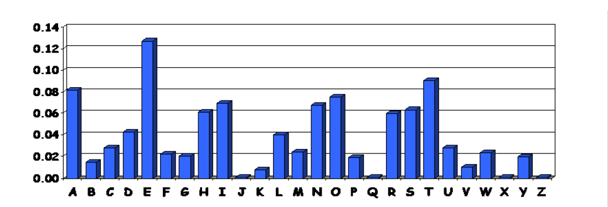
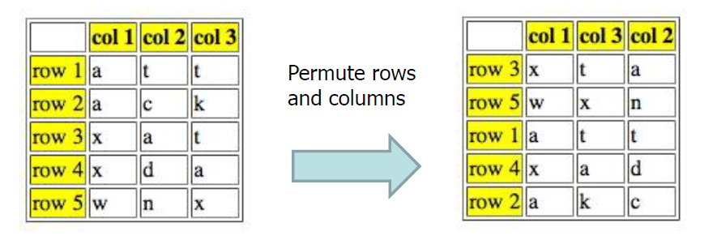
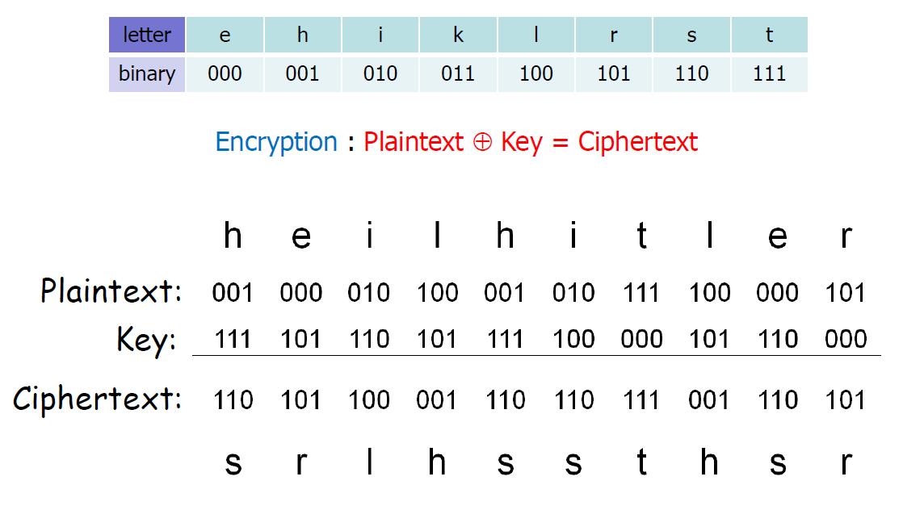

# 컴퓨터 보안

## Ch01. Introduction & crypto basics

### 보안의 3요소

#### 1. 기밀성(Confidentiality)

- 허가 받지 않은 사용자의 접근을 막는다.

  -> 암호화

#### 2. 무결성(Integrity)

- 비허가자의 임의 수정을 막는다.
  - 현실적으로 완전히 막는건 어려우니, 적어도 침입 사실이라도 알아야 한다.

#### 3. 가용성(Availability)

- 사용자가 언제든지 접근이 가능해야 한다.
  - 공격을 방어하면서 서비스 제공 가능
  - 대표적인 가용성 공격 : DDOS공격

### CIA 에 더한 2요소

#### 1. 인증

- 접근한 사용자가 정말로 그 사용자가 맞는지 확인
- Stand-alone

#### 2. 인가

- 인증된 사용자로부터 온 것이더라도, 보낼 데이터를 선발해서 보낸다.
  - **인증이 전제**
  - ex) A가 B가 만든 장바구니 등은 확인 불가하다.

### 보안 위협

- 대부분의 보안 위협은 사람의 실수로 시작된다.
- 보안 위협의 통계
  - 55% 사람의 실수
  - 10% 직원의 불만
  - 10% 산업 스파이
  - 10% 외부 엑세스
  - 나미저는 자연 재해

### 암호학

#### Cryptology

- 암호를 만들고 깨는 기술과 과학

#### Cryptography

- 정보를 보호하는 분야

#### Cryptanalysis

- 보호된 정보를 분석 하는 분야

#### Crypto

- 위의 모든 것을 포함하는 개념.
- 즉, 어떻게 암호화 할 것이냐? **(Key)**

### 대표적인 암호화 방법 2가지

1. 대칭키 암호화

   - 암호화 키와 복호화 키가 같다.

   - 아예 키가 공개가 되지 않는다.

   - 의외로 좋지 않은 방법

     -> 영원히 키를 숨길 수는 없고, 한번 알고리즘이 노출되면 끝.

2. 공개키 암호화

   - 암호화 키와 복호화 키가 다르다
   - 알고리즘은 공개 되어 있지만, 키는 비밀이다.

- plaintext : 암호화 되어 있지 않은 평문
- ciphertext : encypt(암호화) 된 결과

### 암호화

- 기본 가정
  - 시스템은 공격자에게 완전히 알려져있다.
  - 오로지 열쇠만이 비밀이다.
  - Kerckhoffs Principle(케르크호프스의 원리)
    - 암호 알고리즘은 비밀이 아니다.
    - 어떤 비밀이든지, 잠재적인 실패지점은 가지고 있다.
    - **결론 : 비밀이 적고 단순할 수록, 시스템의 안전성을 유지하기가 쉽다.**

### Caesar’s Cipher Decryption

시저 암호는 암호확에서 다루는 간단한 치환 암호의 일종으로, 암호화 하고자 하는 내용을 일정한 거리만큼 밀어서 다른 알파벳으로 치환하는 방식이다.

#### 특징

- 단순 대체(n만큼의 이동)가 사용된다.

- 키를 찾는 방법

  - 최대 26개의 키만 가능

    -> 전부 시도해 보면 간단하게 해결된다.

### Even less Simple Substitution

- 단순히 n만큼의 이동이 아니라 알파벳들을 무작위로 재배치한다.

- 알파벳이 배치 될 수 있는 경우의 수 26!개가 된다
  - 26! >= 288
  - 컴퓨터가 단순 검색을 할 경우, 240초가 필요로 한다. 이건 4450 밀레니엄이 필요

**"키 스페이스는 완전한 검색을 수행할 수 없을 정도로 커야한다. "**에 부합한다.

#### 해결책

- 단, 288에 시간을 전부 검색할 필요가 없다.

- 영어 단어의 알파벳의 빈도수를 조사한다.

1. 가장 많이 언급 되는 알파벳을 e로 가정한다.
2. 그 다음 e를 기준으로 각각 앞에 2글자를 묶어서 The로 검색을 한다.
3. 비슷한 방식으로 알파벳과 단어를 기준으로 찾는다.
   - 가장 자주 나오는 2글자 조합
     - TH, HE, IN, ER, AN, RE, ED, ON, ES, ST, EN, AT, TO, NT, HA, ND, OU, EA, NG, AS, OR, TI, IS, ET, IT, AR, TE, SE, HI, OF
   - 가장 자주 나오는 3글자 조합
     - THE, ING, AND, HER, ERE, ENT, THA, NTH, WAS, ETH, FOR, DTH
4. 이해할 수 있는 문장이 나올때까지 반복

### 암호화 조건

- 키 공간이 충분히 넓어야 한다.
  - 전수조사으로 엄청나게 많은 작업이 필요한 만큼
- 안전해야 한다.
  - 지름길이 없어야 한다.

### Double Transposition Cipher

- 문장을 섞는 방법
- 예를 들면, attack at dawn라는 문장의 경우

- 2차 행렬로 순차로 문장을 배열한 다음에 행렬을 섞는다.
- Key
  - 몇 차원 행렬이냐 가 1번째 문재
  - 각 행, 열을 어떻게 섞었느냐가 2번째 문제.
  - 이 경우의 키는 **행렬 사이즈**와 **(3,5,1,4,2)와 (1,3,2)**가 키 값이 된다.
- 그러니까, **대체와 전합의 조합을 사용하는 것이 안전하다**

### One-time Pad

#### 작동 방식

- 임의 데이터 블록을 이용하는 암호 시스템
  1. Plaintext와 동일한 크기의 키를 생성한다
     - 단, 키는 무작위여야한다.
  2. 이 키를 수신자와 발신자가 둘 다 모두 가지고 있어야 한다.
  3. 발신자는 Plaintext을 Key와 XOR연산을 하여 암호화 시켜서 보낸다
  4. 수신자는 Ciphertext를 다시 Key와 XOR연산하면 원래의 Plaintext가 나오게 된다.

#### 원리

C = Ciphertext

P = Plaintext

Key = K

이런 약자를 사용해보자

------

C = P XOR K

P = C XOR K = (P XOR K) XOR K = P XOR (K XOR K)  = P XOR 0 = P

이런 비트 연산으로 원래의 Plaintext가 복호화 된다.

#### 안정성

- 수학적 안정성이 증면된 방법된 방법중 하나

  1. 키는 무작위로 생성
  2. 길이만큼 키가 생산된다.

- 아무런 키를 넣어도 풀리긴 한다. 

  -> 단, 전혀 다른 의미가 된다.

- 가짜 키에 맞춰도 의미있는 문장을 만들 수 있기 때문에, 키가 맞는지 구분할 수 없다.

#### 한계

- 한번 쓴 키를 다시 쓸 수 없다.
- Ciphertext와 같은 길이의 Key를 어떻게 전달할 것인가.

##### 같은 키를 다시 못 쓰는 이유

C1 = 첫번째 암호문

C2 = 두번째로 전달된 암호문

P1 = 첫번째 암호문을 풀면 나오는 평문

----

C1 XOR C2 XOR P1 = (P1 XOR K) XOR (P2 XOR K) XOR P1 = (P1 XOR P1) XOR (K XOR K) XOR P2

​	= 0 XOR 0 XOR P2 = P2

즉, 한번 사용된 암호문의 평문이 노출 되면 그 다음 평문들을 그대로 복호화 할 수 있다.

### Claude Shannon

Claude Shannon이 제안한 암호학의 2가지 원칙

1. Confusion
   - 원래의 Plaintext로부터 값이 변해서 Ciphertext로부터 복호화 하기 어려워야한다.
2. Diffusion
   - Ciphertext의 단 1bit라도 변경되면 Ciphertext는 변경 이전의 Ciphertext와 절반 이상이 달라져야한다.

**=> 이 2가지를 섞어서 쓰는게 안전하다**

### 보안 공격의 분류

- 공격자가 어떠한 것을 할 수 있느냐의 분리 기능

  - Ciphertext only attack

    - 공격자는 임의의 Ciphertext만이 주어진다.

      -> 패킷만 빼돌리면 되는거라 간단히 할 수 있는 상황

  - Known plaintext attack

    - 공격자는 몇개의 Plaintext를 알고 있다.

      -> 공격자가 과거의 Plaintext와 Ciphertext 둘 다 알고 있는 상황

  - Chosen plaintext attack

    - 공격자가 필요한 Plaintext와 Ciphertext 몇 번 만들어 낼 수 있다.
    - Lunchtime attack : 점심 시간에 몰래 가서 평문과 암호문을 만들어 낸다는 의미

  - Adaptively chosen plaintext attack

    - 공격자가 필요할 때마다 Plaintext와 Ciphertext를 만들어 낼 수 있다.
    - plaintext attack