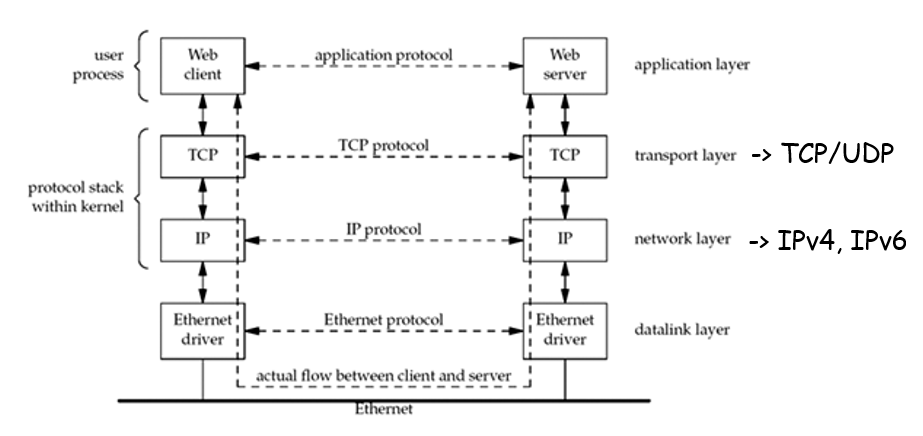

# 컴퓨터 네트워크
## Ch02. UNIX Network Programming
### Introduction
#### Network application : client and Server
- Client : 메세지를 서버에 보낸다.
- Server : 클라이언트로 보내진 메세지에 응답한다.
- Protocol : 클라이언트와 서버 간에 교환되는 메시지의 형식과 순서, 그리고 메시지의 전송 및 수신에 대해 취한 조치

#### TCP/IP protocol suite(internet protocol suite)
- 클라이언트와 서버는 일반적으로 사용자 프로세스이다.
- TCP 와 IP 프로토콜은 일반적으로 커널 내의 프로토콜 스택의 일부분이다.



#### Client and server on different LANs connected through a WAN 
- WAN[^WAN]을 통해 연결된 서로 다른 LAN[^LAN]의 클라이언트 및 서버


### A Simple Daytime Client
```c
//intro/daytimetcpcli.c

#include "unp.h"

int main(int argc, char **argv) {
    int sockfd, n;
    char recvline[MAXLINE + 1];
    struct sockaddr_in servaddr;

    if(argc!=2)
        err_quit("usage : a out <IPaddress>");
    
    if((sockfd = sockfd(AF_INET,SOCK_STREAM,0))<0)
        err_sys("socket error");
    
    bzero(&servaddr,sizeof(servaddr));
    servaddr.sin_family = AF_INET;
    servaddr.sin_port = htons(13);  // daytime server posrt number

    if(inet_pton(AF_INET,argv[1],&servaddr.sin_addr)<=0)
        err_quit("inet_pton error for %s",argv[1]);

    if(connect(sockfd,(SA *)&servaddr,sizeof(servaddr))<0)
        err_sys("connet error");
    
    while ( (n=read(sockfd,recvline,MAXLINE))>0) { //Read and display server's reply
        recvline[n] = 0;    // null terminate
        if(fputs(recvline,stdout)==EOF)
            err_sys("fputs error");
    }

    if(n<0)
        err_sys("read error");
    
    exit(0);    // Terminate program

}
```
요청 방법

```bash
$ ./a.out 206.168.112.96
Mon May 26 20:58:40 2003
```
- 자체 헤더 사용.
    - unp.h : 부록 D.1
- TCP 소켓을 생성한다.
- 서버의 IP주소와 포트를 확인
    - inet_pton : 숫자로 인터넷 표시
    - err_ : error 출력함수, 부록 D.3
- 서버와의 연결 설립
    - SA : 소켓주소 주소
- 서버 응답 읽기 및 표시
- 프로그램을 종료한다.


### Protocol Independence
#### Version of IPv6
```c
//intro/daytimetcpcliv6.c
# include "unp.h"

int main(int argc, char **argv)
{
    int sockfd, n;
    char revline[MAXLINE + 1];
    struct sockaddr_in6 servaddr;

    if(argc != 2)
        err_quit("usage: a.out <IPaddress>");

    if( (sockfd = socket(AF_INET6,SOCK_STREAM,0))<0)
        err_sys("socket error");
    
    bzero(&servaddr, sizeof(servaddr));
    servaddr.sin_family = AF_INET6;
    servaddr.sin_port = htons(13) // daytimeserver

    if(inet_pton(AF_INET6, argv[1], &servaddr.sin6_addr)<=0)
        err_quit("inet_pton error for %s", argv[1]);

    if(connect(sockfd,(SA *)&servaddr,sizeof(servaddr))<0)
        err_sys("connect error");

    while ( (n= read(sockfd,revline,MAXLINE))>0) {
        revline[n] = 0;
        if(fputs(revline,stdout)==EOF)
            err_sys("fputs error");
    }

    if(n < 0)
        err_sys("read error");

    exit(0);
}
```

### Error Handing
#### wrapper function
- 실제 기능 호출을 수행하고, 반환 값을 테스트한 후 오류 발생 시 종료
- 함수의 이름을 대문자로 쓴다.

```c
sockfd = Socket(AF_INET, SOCK_STREAM,0);
```

```c
// lib/wrapsock.c

int Socket(int family, int type, int protocol)
{
    int n;
    if( (n = socket(family, type, protocol)) < 0 )
        err_sys("socket error");
    return (n);
}
```
#### Unix errno Value
- 유닉스 함수에서 오류가 발생하면, 전역변수 *errno*은 오류 유형을 나타내는 양수로 설정되고, 함수는 일반적으로 -1을 반환한다.
- *errno* 값은 "E"로 시작되는 대문자 이름이다.
    - 보통 *<sys/errno.h>*에 정의된다.
    - 값이 0인 오류는 존재하지 않는다.
- *errno*은 멀티 쓰레드와 함께 작동되지 않는다.
- 연결 함수는 *ECONNREFUSED*를 반환한다.
    - 함수는 지정된 *errno*을 error(-1)로 반환한다. 

-----
[^WAN]: LAN과 LAN사이를 광범위한 지역 단위로 구성하는 네트워크.
[^LAN]: 사용자가 포함된 지역 네트워크를 의미한다. 공유기나 스위치를 이용해서 연결하게 된다.