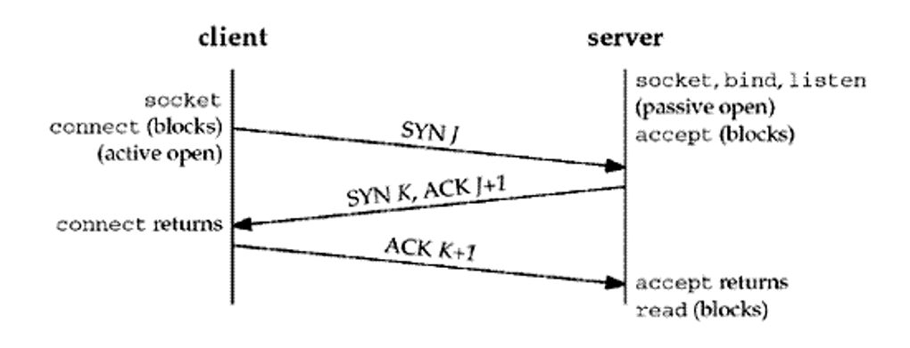
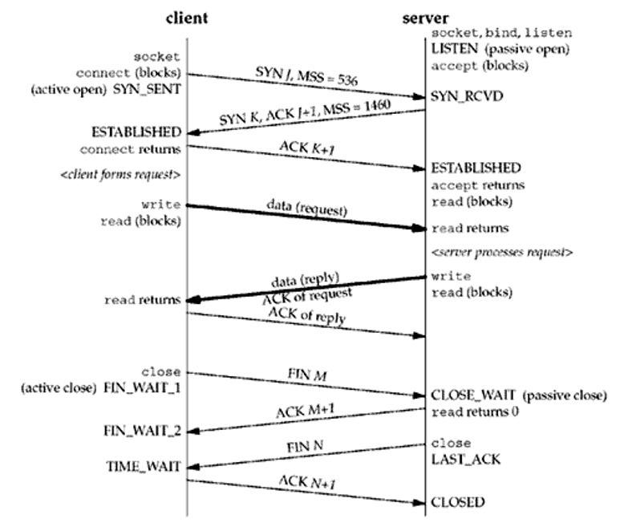
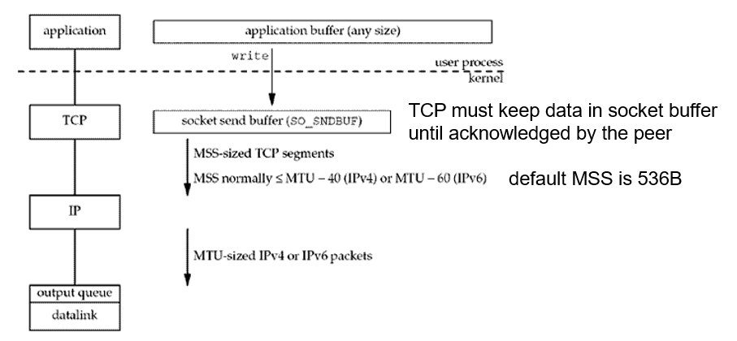
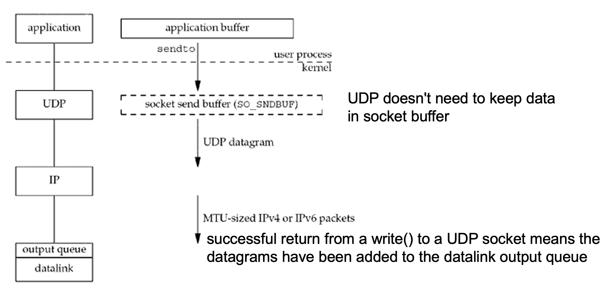
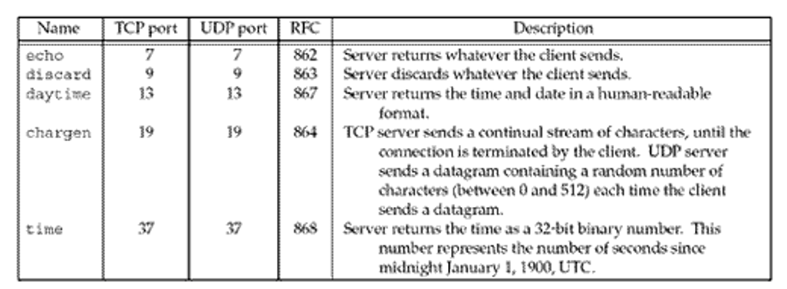

# 컴퓨터 네트워크

## Ch02. Transport Layer

### Introduction
- Transport Layer : TCP, UDP, and SCTP
    - **UDP**는 간단하고, 신뢰할 수 없는 데이터그램[^데이터그램] 프로토콜
    - **TCP**는 정교하고, 신뢰할 수 있는 바이트스트림[^바이트스트림] 프로토콜
    - **SCTP**는 신뢰할 수 있는 전송 프로토콜로 TCP와 유사하지만, 메세지 경계, 멀티 호밍에 대한 전송 수준 지원, 그리고 최전방 차단을 최소화 하는 방법들을 제공한다.
        -SCTP는 원래 인터넷을 통한 전화 신호용으로 설계 되었다.

### User Datagram Protocol(UDP)
- UDP 는 간단한 전송계층 프로토콜
    - RFC768에 기술되었다.
    - 어플리케이션이 UDP 소켓에 메세지를 쓴다.
    - 그 다음, 메세지는 UDP datagram에 캡슐화 된다.
    - UDP 데이터 그램은 전송이 보장되어 있지 않음.
    - 각 UDP 데이터 그램에는 길이가 있다.(경계까 있다.)
    - 무연결 소켓 제공
        - UDP소켓은 다른 소켓에 그대로 사용 될 수 있다.

### Transmission Control Protocol(TCP)
- TCP는 신뢰할 수 있는 전송 프로토콜
    - RFC793에 기술되었고, 많은 RFC에서 업데이트 됨.
    - TCP가 데이터를 특정 임계값까지 재전송
        - 신뢰할 수 있는 데이터 전송또는 신뢰할 수 있는 오류 통지
    - 번호 순서대로 전송되는 것을 보장한다.
    - 윈도우를 통해 흐름 제어를 제공한다.
    - TCP는 전이중 연결 방식이다.
        - 앱은 한번에 주어진 연결로 양방향으로 데이터를 주고 받을 수 있다.
        - TCP는 각 방향에 대한 seq num, 창 크기와 같은 상태 정보를 추적해야한다.

### Stream Control Transmission Protocol(SCTP)
- SCTP 는 UDP및 TCP와 유사한 서비스를 제공한다.
    - RFC2960에 기술되고, RFC 3309에 의해 업데이트됨
    - 클라이언트 및 서버 제공
    - TCP와 마잔가지로 신뢰성, seq, 전이중 제공
    - TCP와는 달리 메세지 지향적
    - 개별메세지의 순차적 전달
    - UDP와 마찬가지로 레코드 길이는 수신기로 전달된다.
    - 연결 끝점에 여러 스트림 제공
    - 손실된 MSG는 다른 스트림에서 MSG전달을 차단하지 않는다.
    - 다중 호밍 방식을 제공한다.
    - 단일 SCTP 엔드포인트에서 여러 IP 주소 지원
    - 네트워크 장애에 대한 견고성을 높이다.

### TCP Flag
#### SYN
- TCP에서 세션을 성립할 때 가장 먼저 보내는 패킷, 시퀸스 번호를 임의적으로 설정하여 세션을 연결하는데 사용한다.
#### ACK
- 상대방으로부터 패킷을 받았다는 걸 알려주는 패킷, 다른 플래그와 같이 출력되는 경우도 있다. M번째 패킷을 받았다면 ACK M을 보낸다. 만약 제대로 ACK을 받았다면 성공했다고 가정하고 다음 패킷 전송
#### RST
- 재 연결을 하는 과정, 양방향에서 동시에 일어나는 중단 작업이다. 비 정상적인 세션 끊기에 해당한다. 이 패킷을 보내는 곳이 현재 접속하고 있는 곳과 즉시 연결을 끊고자 할 때 사용한다.
#### FIN
- 세션 연결을 종료시킬 때 사용 되며 더이상 전송할 데이터가 없음을 알려준다.

### TCP Connection Management
#### TCP connection establishment
- three-way handshake

1. 클라이언트가 서버에 데이터 교환을 시작하기 위해 SYN을 전송한다.
2. 서버는 받았다는 의미와 ACK과 함께 자신도 연결을 하겠다는 의미로 SYN을 보낸다.
3. 클라이언트도 받았다는 의미로 ACK을 전송
   
- 클라이언트는 스스로가 원해서 여는 입장이다보니 active open
- 서버는 요청을 받아서 여는 입장이다 보니 passive open

#### Each SYN can Contain TCP options
- MSS(Max Segment Size) option
    - SYN은 연결의 각 TCP 세그먼트에서 허용할 최대 데이터 양을 알려준다.

#### TCP connection termination

1. 클라이언트가 모든 연결이 끝났다는 의미로 FIN을 전송한다.
2. 서버는 알았다는 의미로 ACK을 전송한다.
3. 서버는 잠시간의 기다림 끝에 FIN을 전송한다.
4. 클라이언트는 알았다는 의미로 ACK을 전송한다.

- 서버가 잠시 후에 FIN을 보내는 이유 : 
    - 바로 전송하면 FIN이 먼저 도착해 연결을 닫아버리면 안되기 때문에

#### TCP connection

#### Watching the packets

#### TIME_WAIT STATE
- TCP의 가장 마지막 단계, close를 먼저 요청한 곳에서 남기고, 2MSL만큼 유지된다.
- TIME_WAIT 상태의 이유
    - TCP의 전 이중 연결을 신뢰성 있게 구현하기 위해서
        - 클라이언트의 최종 ACK이 손실되면 서버는 다시 FIN을 전송한다.
    - 오래된 중복 세그먼트가 네트워크에서 만료되도록 허용한다(즉, 세그먼트가 오랫동안 네트워크에 떠돌아 다니면 알아서 종료된다.)
        - 종료 직후 동일한 IP 주소와 포트번호를 재이용할 경우, 오래된 전 이중 세그먼트와 구분이 불가능하다.
        - 그래서, 우리는 오래된 세그먼트가 TTL[^Time to Live]에 의해 만료 되도록 시간을 준다.

### Port Numbers
#### 16-bit integer port number
- 포트 번호 내에서 프로세스를 구별한다
- 잘 알려진 서비스를 식별하기 위한 잘 알려진 포트
    - FTP(21), Daytiem server(13)
- 클라이언트가 사용 후 삭제 하는 포트도 있다(단기 사용 포트)
    - 전송 프로토콜에 의해 자동으로 할당됨

#### IANA에서 포트 번호 할당 유지 관리
- 잘 알려진 포트(0~1023)
    - IANA에 통제되고 할당되는 포트들이다.
- 등록된 포트(1024~49151)
    - IANA에 의해 제어되진 않지만, IANA에 의해 등록되고 나열된다.
- 동적 개인 포트(49152~65535)
    - 제어 불가, 사용 후 삭제 되는 포트

#### Port Numbers 할당

- 잘 알려진 포트(0~1023)의 사용(열고 닫거나, 아니면 사용방식으로 바꾸거나)할 때는 슈퍼 유저 권한이 필요하다.

#### Socket pair for a TCP connection
- 코너의 두 끝점을 정의하는 네개의 튜플
- 로컬 IP 주소, 로컬 포트, 외부 IP 주소, 외부 포트
- 모든 TCP연결을 고유하게 힉별
- 각 끝점(IP 주소 및 포트)를 식별하는 두 값을 종종 "소켓"이라고 부른다.

### Buffer Sizes and Limitations
- IP 데이터그램의 최대 크기는 65,535바이트이다.
    - 16 bit 페이로드 필드 길이 때문이다.
- 많은 네트워크에는 HW에 의해 지시될 수 있는 MTU[^MTU]가 있다.
- 경로에서 가장 작은 MTU를 "path MTU"라고 한다.
- 데이터그램 크기가 링크 MTU를 초과할 때 조각화가 수행된다.
- TCP에서 MSS(Max Segment Size)
    - 피어가 세그먼트당 전송할 수 있는 최대 TCP 데이터양(16비트 MSS가 SYN에 있음)
    - MSS는 종종 MTU에서 IP 및 TCP헤더를 뺀 값으로 설정된다.
    - IPv4 또는 IPv6을 사용하는 이더넷의 경우 1460B 또는 1440B

#### TCP output
- 소켓 버퍼에 공간이 부족할 경우 프로세스가 중지(sleep)됨(최종 바이트 작성 후 반환)

#### UDP output
- 소켓 버퍼가 실제로 존재하지 않음
    - UDP 소켓에는 송신 버퍼 크기가 있지만 이는 단순히 상한값일 뿐이다.

#### Standard TCP/IP services

- 서비스 이름은 /etc/services에 의해 포트 번호에 매핑된다.
----
[^데이터그램]: 인터넷을 통해 전달되는 정보의 기본 단위
[^바이트스트림]: 스트림이람 순서가 있는 데이터의 연속적인 흐름이다. 바이트 스트림이란 바이트 단위로 제어되는 스트림.
[^Time to Live]: 네트워크 에서 데이터의 유효 기간을 나타내는 방법. 정해진 유효 시간이 지나면 데이터는 폐기된다.
[^MTU]: 패킷 또는 프레임 기반의 네트워크에서 전송될 수 있는 최대 크기의 패킷 또는 프레임을 말한다.