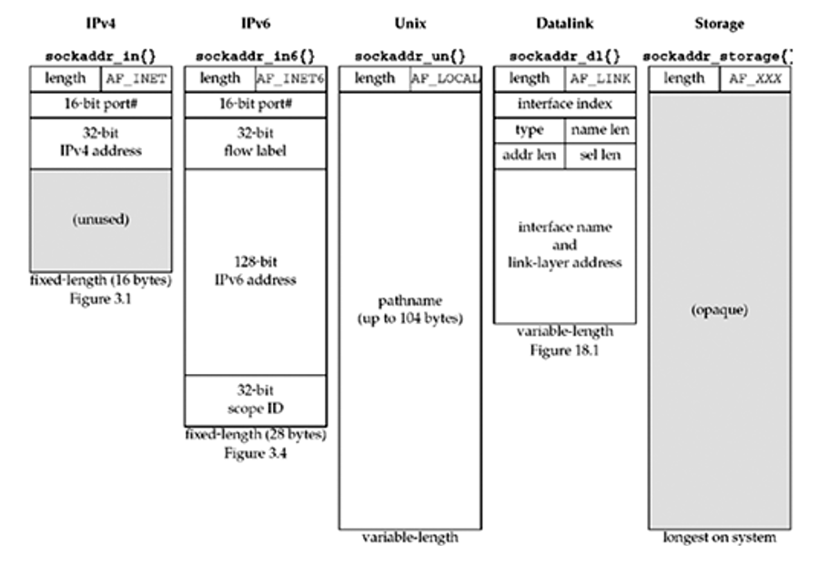
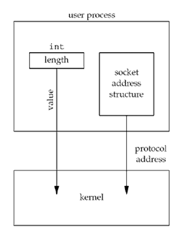

# 컴퓨터 네트워크
## Ch03. UNIX Network Programming
### Socket Address Structure
#### IPv4 socket address structure

```c
struct in_addr {
    in_addr_t   s_addr;             //32비트 IPv4의 주소
                                    //네트워크 바이트 순서
};

struct sockaddr_in {
    uint8_t         sin_len;        // 구조체의 길이(16)
    sa_family_t     sin_family;     // AF_INET
    in_port_t       sin_port;       // 16bit TCP or UDP 포트 번호
                                    // 네트워크 바이트 순서
    struct in_addr sin_addr;        // 32bit IPv4의 주소
                                    // 네트워크 바이트 순서
    char            sin_zero[8];    // 미사용
};
```


#### IPv6 socket address structure
```c
struct in6_addr {
    unit8_t   s6_addr[16];          //128비트 IPv6의 주소
                                    //네트워크 바이트 순서
};

#define SIN6_LEN                    // 컴파일 시간 테스트를 위해서

struct sockaddr_in {
    uint8_t         sin6_len;       // 구조체의 길이(16)
    sa_family_t     sin6_family;    // AF_INET
    in_port_t       sin6_port;      // 16bit TCP or UDP 포트 번호
                                    // 네트워크 바이트 순서
    unit32_t        sin6_flowinfo   // 정의되지 않은 흐름 정보
    struct in6_addr sin6_addr;      // 32bit IPv4의 주소
                                    // 네트워크 바이트 순서
    unit32_t        sin6_scope_id;  // 미사용
};
```

#### 일반 소켓 구조
- 지원되는 모든 프로토콜을 처리하기 위해
```c
struct sockaddr {
    unit8_t     sa_len;
    sa_family   sa_family;      // address family : AF xxx 값
    char        sa_data[14];    // 프로토콜 확인 주소
};
```
- 예. int bind(int, struct sockaddr *, socklen_t);
    - bind(sockfd, (struct sockaddr *) &serv, sizeof(serv));

#### 소켓 주소 구조 비교


### Value-Result Arguments
#### 프로세스에서 커널로 전달된 소켓 주소 구조
- 프로세스가 만든 구조체를 커널이 참조


### Byte Ordering Functions
#### Little-endian vs Big-endian
- Big-endian
    - 큰 단위가 앞에 나오는 것을 말한다.
        - MSB at lower address -> Big endian
        - 사람이 읽는 방식과 똑같으므로 보기 편하다.
    - 작은 단위가 앞에 나오는 것을 말한다.
        - LSB at lower address -> Little endian
        - 주로 수정되는 부분은 작은 자릿 수 이므로 컴퓨터의 계산이 빠르다.


#### Byte order
- Host byte order 
    - 시스템 내에서 주어진 대로 사용한다.
- Network byte order 
    - 네트워크 프로토콜 내에서 사용한다.(빅-엔디안)

- 즉, 각자의 시스템에서 사용될때는 각자 정의된 바이트 오더를 사용하지만, 네트워크로 전송할때는 빅 엔디안을 사용한다.

#### Byte order converting function
```c
#include<netinet/in.h>

//h: host, n: network
//s: 16bits, l: 32bits

uint16_t htons(uint16_t host16bitvalue);
uint32_t htonl(uint32_t host16bitvalue);
// both retrun; value in network byte order

uint16_t ntohs(uint16_t host16bitvalue);
uint32_t ntohl(uint32_t host32bitvalue);
// both retrun; value in host byte order
```

### Byte Manipulation Functions
#### From 4.2BSD
```c
#include<string.h>
void bzero(void *dest,size_t nbytes);
void bcopy(const void *src, void *dest, size_t nbytes);
int bcmp(const void *ptr1, const void *ptr2, size_t nbytes);
// return: 0 if equal,nonzero if unequal
```

#### From ANSI C
```c
#include<string.h>
void *memset(void *dest, int C, size_t len);
void *memcpy(void *dest, const void *src, size_t nbytes);
int memcmp(const void *ptr1, const void *ptr2, size_t nbytes);
//Returns: 0 if equal,<0 or>0 if unequal(see text)
```

### Address Conversion Functions
#### IPv4 (a : ASCII, n : numeric)
```c
#include <arpa/inet.h>

int inet_aton(const char *strptr, struct in_addr *addrptr);
//IP주소를 네트워크 바이트 순서의 정수형으로 정렬
// Returns : 1 if string was valid, 0 on error

in_addr_t inet_addr(const char *strptr);
// Return : 32-bit binary network bype ordered IPv4 address;
// INADDR_NONE if error
//성공시 in_addr_t 타입의 정수 값 return, 실패시 INADDR_NONE return.

char *inet_ntoa(struct in_addr inaddr);
// Return : pointer to dotted-decimal string
// 성공시 IP주소 문자열의 주소값, 실패시 -1 return.
```
- inet_aton("206.168.112.96", &foo.sin_addr);
    - foo.sin_addr에 지정된 ip 를 네트워크 바이트로 저장한다.
- str = inet_ntoa(foo.sin_addr);
    - 네트워크 바이트 순서의 32비트의 값을 주소값으로 변환

#### IPv4 and IPv6 (p : presentation, n : numerics)
```c
#include <arpa/inet.h>
int inet_pton(int family, const char * strptr, void *addrptr);
// Reuturns : 1 if OK, 0 if input not a valid presentation format, -1 on error

const char *inet_ntop(int family, const void, char *strptr, size_t len);
// Return: pointer to result if OK, NULL on error
```
- 각자 IP 주소를 빅 엔디안 이진데이터로 변환하거나 빅엔디안 이진 데이터를 IP형태로 변경하는 것.

- inet_pton(AF_INET, "206.168.112.96", &foo.sin_addr);
- inet_ntop(AF_INET, &foo.sin_addr, str, sizeof(str));
    - char str[INET_ADDRSTRLEN];	// for IPv4
    - char str[INET_ADDRSTRLEN6];	// for IPv6

### Stream Read/Write Functions
- Stream socckets(예. TCP소켓)는 요구한 read/write functions보다 더 적은 바이트를 읽는다.
    - 커널의 버퍼 제한 때문 일수도 있음.
    - 요청된 데이터 양에 도달하려면 읽기 쓰기는 반복적으로 호출

#### 스트림 소켓 지원 함수
```c
#include "udp.h"
ssize_t readn(int filedes, void * buff, size_t nbytes);
ssize_t writen(int filedes, const void *buff, size_t nbytes);
ssize_t readline(int filedes, void *buff, size_t maxien);
// All return : number of bytes read or writen, -1 on error
```
 
 ### Stream Read/Write Functions
 #### readn function
```c
#include "unp.h"

```