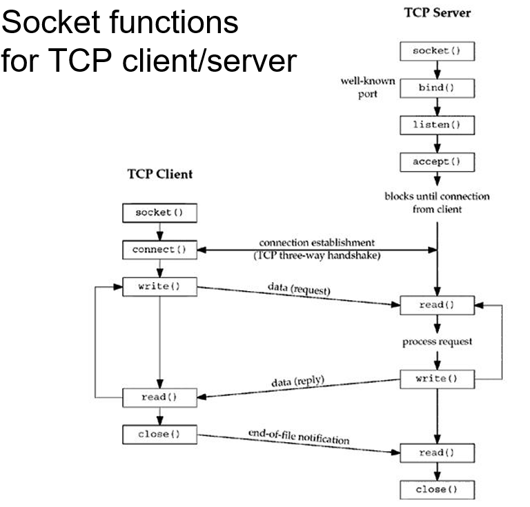
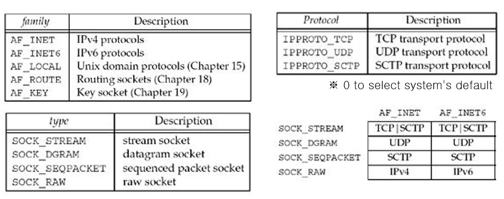
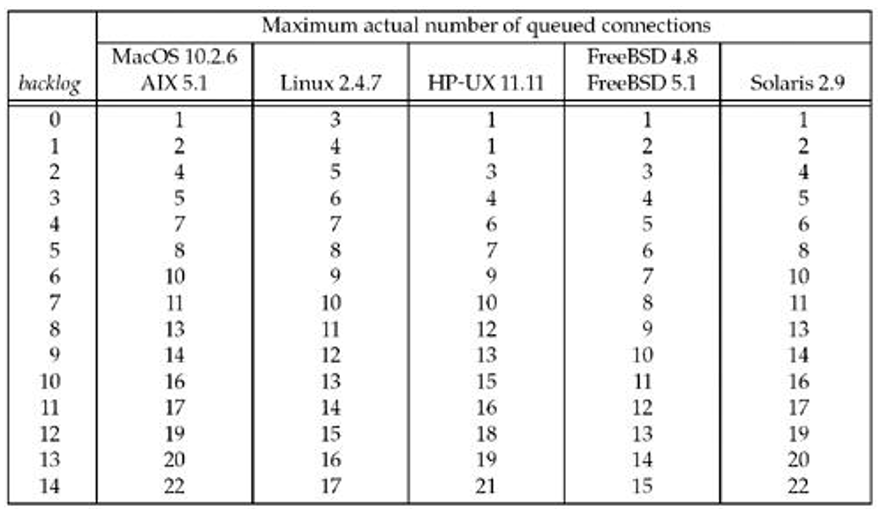

# 컴퓨터 네트워크
## Ch04. UNIX Network Programming
### Elementary TCP Sockets
#### Socket functions for TCP client/server


#### Socket Function
``` C
#include <sys/socket.h>
int socket(int family, int type, int protocol);
// Returns: non=negative descriptor if OK, -1 on error
```


#### connect Function
```c
#include<sys/socket.h>
int connect(int sockfd, const struct sockaddr *servaddr, socklen_r addrlen);
// Return: 0 if OK, -1 on error
```
- sockfd는 소켓 함수에 의해 반환되는 소켓 설명자
- servaddr 과 addrlen은 IP 주소와 서버프로세스의 포트 넘버를 저장하고 있는 포인터이다.
- 필요한 경우 커널은 사용 후 삭제 포트와 src IP 추가자를 모두 선택한다.
- 함수는 오직 연결이 성공하였을때나 에러가 발생했을때만 반환한다.
  - ETIMEDOUT: SYN 세그먼트에 대한 응답 없음
  - ECONNREFUSED: 서버 프로세스가 없으므로(하드 오류) RST 세그먼트 수신
  - EHOSTUNREACH 또는 ENETUNREACH: ICMP "접근할 수 없는 대상" 수신 및 일정 시간 후 응답 없음
##### connect examples
  - local host server
    ``` Linux
    % daytimetcpcli 127.0.0.1
    Sun Jul 27 22:01:51 2003
    ```
  - differnt host server
    ``` Linux
    % daytimetcpcli 192.6.38.100
    Sun Jul 27 22:01:51 2003
    ```
  - no server host in local net
    - no ARP([^주소 결정 프로토콜]) reply and connect time out
    ``` Linux
    % daytimetcpcli 192.6.38.100
    connect error: Connection time out
    ```
  - no server process
    - return RST segment(리셋 세그먼트)
    ``` Linux
    % daytimetcpcli 192.6.38.100
    connect error: Connection refused
    ```
  - unreachable server host
    - ICMP "host unreachable error"
    ``` Linux
    % daytimetcpcli 192.6.38.100
    connect error: No route to host
    ```

### bind Function
```c
#include<sys/socket.h>
int bind (int sockfd, const struct sockaddr *myaddr, socklen_t addlen);
// Return 0 if OK, -1 on error
```
- 소켓에 로컬 프로토콜 주소(IP + Port)를 할당한다.
  
- IPv4 와일드 카드 주소 설정
  ``` c
  struct sockaddr_in servaddr;
  servaddr.sin_addr.s_addr = htonl(INADDR_ANY); //wildcard
  ```
- 앱에서 백로그에 대해 지정할 값을 선택하십시오.
  - 5는 종종 부적합
  - 상수 설정에는 서버를 다시 컴파일 해야함.
  - 솔루션에서 환경변수 LEARQ 사용

### listen Fuction
```C
#include<sys/socket.h>
int listen(inst sockfd, int backlog);
// Return 0 if OK, -1 on error
```
- 연결되지 않은 소켓을 passive 소켓으로 변환시킨다.
  - 커널은 이 소켁에 오는 연결 요청을 수락해야한다.
- 백로그는 커널이 이 소켓에 queue 하는 최대 연결 수를 지정한다.


```c
void Listen(int fd, int backlog)
{
  char *ptr;  //can override 2nd arguemnt with environment variable
  if ( (ptr = getenv("LISTENNQ")) !=NULL)
    backlog = atoi(ptr);
  if (listen (fd, backlog) < 0)
    err_sys ("listen error")
}
```
- 백로그를 위해 queue중인 연결 번호
  

### accept Function
```C
#include <sys/socket.h>

int accept(int sockfd, struct sockaddr *cliaddr, socklen_t *addlen);
// Retruns : non- negative desciptor if OK, -1 on error
```
- TCP server는 큐로부터 다음으로 완료된 conn을 반환함
  - 만약 연결 대기열(queue)가 비었다면, 프로세스는 sleep(blocking)한다
- cliaddr 와 addrlen은 클라이언트의 주소와 그것의 사이즈를 반환한다.
  - 클라이언트 주소에 관심이 없는 경우 null(즉, 0) 설정
- fn의 리턴값은 새로운 소켓 설명자이다.
  - 리턴값은 소켓에 연결되고, arg 안의 sockfd은 리스닝 소켓이다.
  - 연결이 사용된 다음에, 이것은 closed된다.

#### Example: value-result arguments
- code
``` c
len = sizeof(cliaddr);
connfd = Accept(listenfd, (SA *) &cliaddr, &len);
printf("connection from %s, port %d\n",
        Inet_ntop(AF_INET, &cliaddr.sin_addr, buff, sizeof(buff)),
        ntohs(cliaddr.sin_port));
ticks = time(NULL);
snprintf(buff, sizeof(buff), "%.24s\r\n", ctime(&ticks));
Wirte(connfd, buff, strlen(buff));

Close(connfd)
```
- output
```
# daytimetcpsrvl
connection from 127.0.0.1, port 43388
connection from 192.168.1.20, port 43389
```

----

[^주소 결정 프로토콜]: 네트워크 상에서 IP주소를 물리적 네트워크 주소도 bind시키기 위해 사용되는 프로토콜

