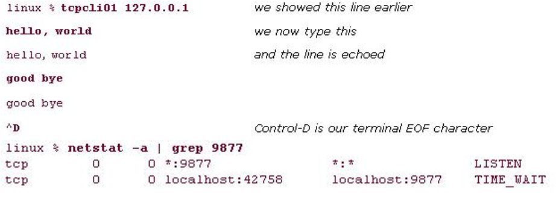

# 컴퓨터 네트워크
## Ch05. TCP Client/Server Example
### Introduction
#### Simple echo client and server
- 클라이언트는 표준 입력에서 텍스트 줄을 읽고 서버에 쓰기
- 서버는 네트워크 입력을 읽고 다시 클라이언트로 반환한다.
- 클라이언트는 표준 출력에 대해 반환된 것을 읽고, 표준 출력한다.


### TCP Echo Server
```C
#include "tcp.h"

int main(int srgc, char **argv)
{
    int listenfd, connfd;
    pid_t childpid;
    socklen_t childlen;
    struct sockaddr_in cliaddr, servaddr;

    listenfd = Socket(AF_INEF, SOCK_STREAM, 0);

    bzero(&servaddr, sizeof(servaddr));
    servaddr.sin_familly = AF_INET;
    servaddr.sin_addr.s_adrr = htonl(INADDR_ANY);

    Bind(listenfd, LISTENQ);

    for(;;) {
        clilen = sizeof(cliaddr);
        connfd = Accept(listenfd, (SA *) &cliaddr, &cliaddr);

        if( (childpid = Fork()) == 0)   // child process
        {
            Close(listenfd);    // 리스팅 소켓을 닫는다.
            str_echo(connfd);   // 리퀘스트를 진행한다.
            exit();
        }
        Close(connfd);  // 부모의 연결 소켓을 닫는다.
    }
}
```

### TCP Echo Client
```c
#inlcude "unp.h"

#define MAXLINE 1000000

void str_cli(FILE *fp, int sockfd)
{
    char sendline[MAXLINE], recvline[MAXLINE];

    while ( fgets(sendline, MAXLINE, fp) != NULL)
    {
        Writen(sockfd, sendline, strlen (sendline));

        if(Readline(sockfd, recvline, MAXLINE) == 0)
            err_quit("str_cli; server terminateed permaturely");
        Fputs(recvline, stdout)
    }
    
}

int main(int argc, char **argv)
{
    int sockfd;
    struct sockaddr_in servaddr;

    if (argc != 2)
        err_quit("usage: tcpli <IPaddress>");
    
    sockfd = Socket(AF_INET, SOCK_STREAM, 0);

    bzero(&servaddr, sizeof(servaddr));
    servaddr.sin_family = AF_INET;
    servaddr.sin_port = htons(SERV_PORT);
    inet_pton(AF_INET, argv[1], &servaddr.sin_addr);

    Connect(sockfd, (SA *) &servaddr, sizeof(servaddr));

    str_cli(stdin, sockfd);
    exit(0);
}
```
### Normal Startup
- before starting client in a server
    

- after starting the client in a server
    

- closing client in a server
    

- 상위 서버 프로세스가 하위 서버 프로세스를 종료한 후 SIGCHLD 신호를 처리하지 않을 경우 하위 서버 프로세스는 좀비 상태로 이동한다.
    
